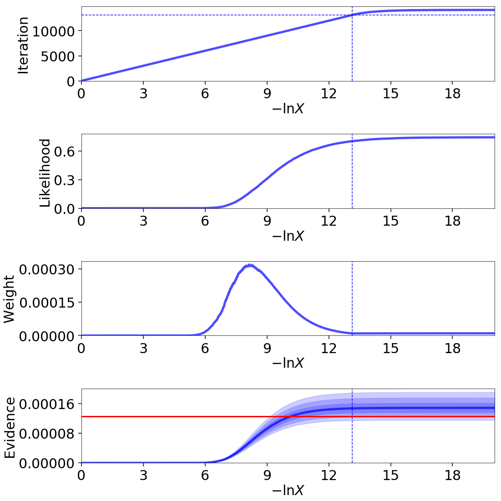
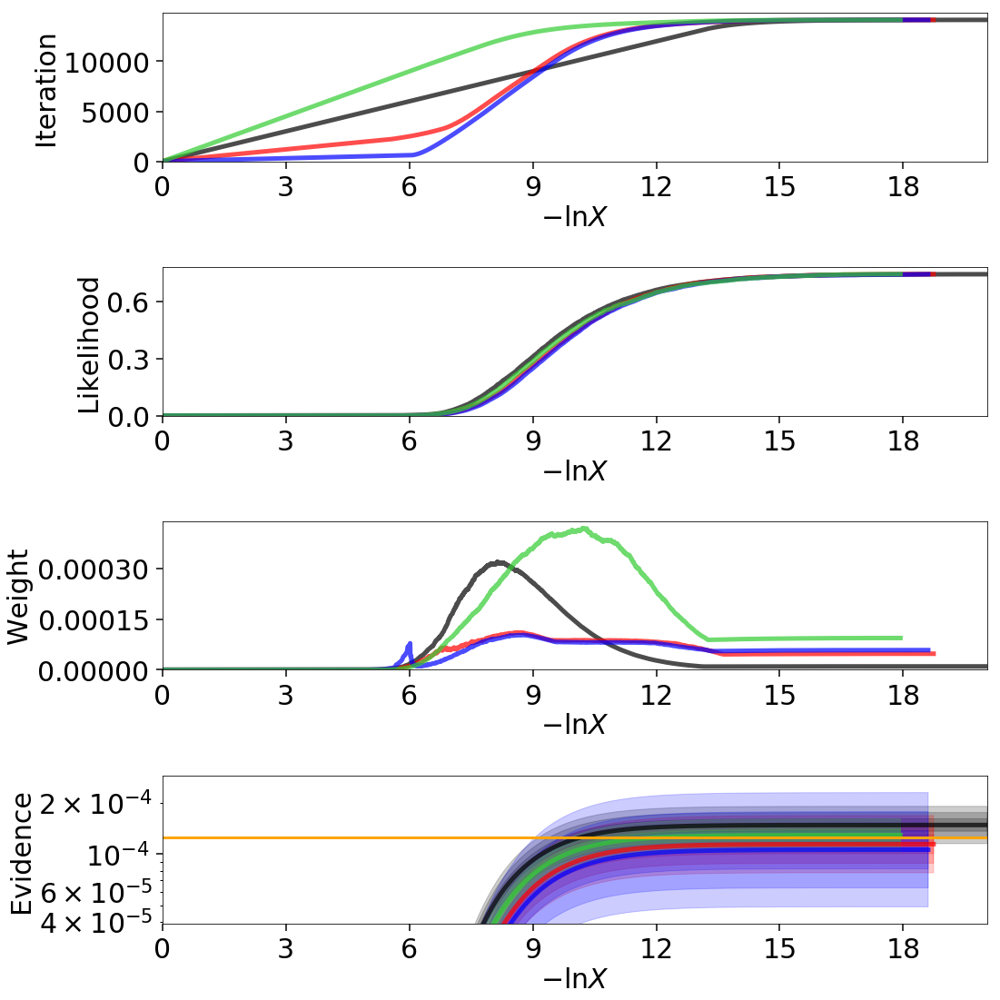
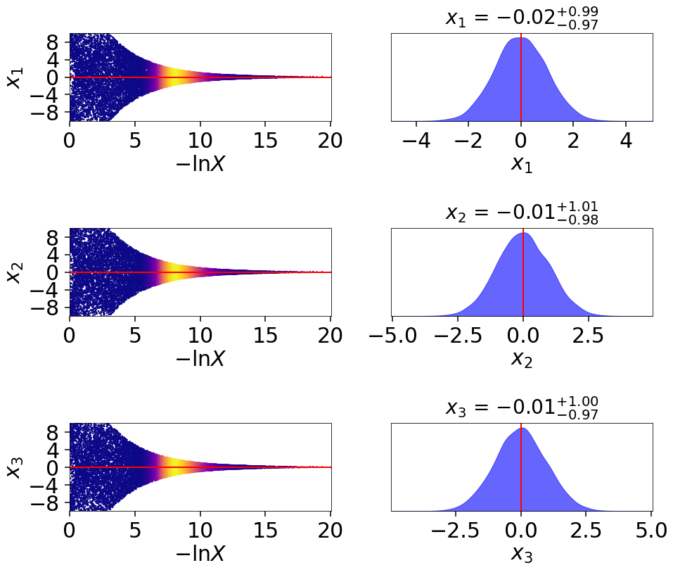
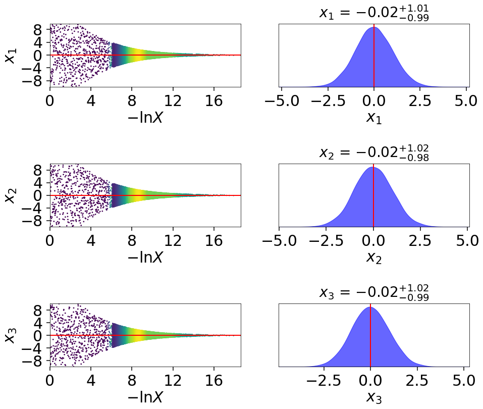
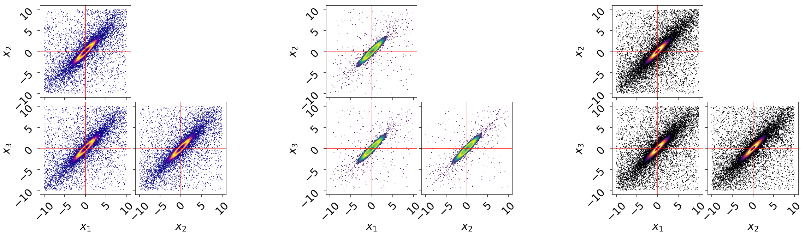
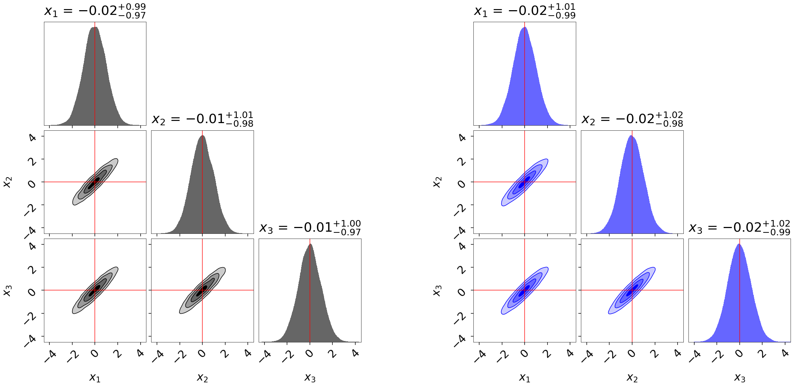

====================================
Dynamic Nested Sampling with dynesty
====================================

Static Nested Sampling
======================

In most applications, scientists are often as interested (if not significantly
more interested) in estimating the **posterior** rather than the evidence. From
a posterior-oriented perspective, Nested Sampling's ability to robustly sample
from complex, multi-modal distributions often makes it an attractive
alternative to methods such as Markov Chain Monte Carlo (MCMC) which struggle
under those conditions.

The main drawback of Nested Sampling, however, is that **it is designed to
estimate the evidence, not the posterior**. In particular, in a given Nested
Sampling run with :math:`K` live points, the prior volume
:math:`X` evolves as:

.. math::

    \Delta \ln X_i \approx \frac{1}{K}

This behavior holds true everywhere, regardless of where the bulk of the
posterior mass is. So while increasing the number of live points increases
our resolution while integrating over the typical set, it simultaneously
increases our resolution everywhere else, leading to longer runtimes. In other
words, the *proportion* of "wasted" samples remains approximately constant.

We can illustrate this directly using the same example from 
:ref:`Crash Course`::

    import numpy as np
    import dynesty
    from dynesty import plotting as dyplot

    # Define the dimensionality of our problem.
    ndim = 3

    # Define our 3-D correlated multivariate normal log-likelihood.
    C = np.identity(ndim)
    C[C==0] = 0.95
    Cinv = linalg.inv(C)
    lnorm = -0.5 * (np.log(2 * np.pi) * ndim +
                    np.log(np.linalg.det(C)))

    def loglike(x):
        return -0.5 * np.dot(x, np.dot(Cinv, x)) + lnorm

    # Define our uniform prior via the prior transform.
    def ptform(u):
        return 20. * u - 10.

    # Sample from our distribution.
    sampler = dynesty.NestedSampler(loglike, ptform, ndim,
                                    bound='single', nlive=1000)
    sampler.run_nested(dlogz=0.01)
    res = sampler.results

    # Plot results.
    lnz_truth = ndim * -np.log(2 * 10.)  # analytic evidence solution
    fig, axes = dyplot.runplot(res, lnz_truth=lnz_truth)

.. rst-class:: sphx-glr-script-out

Out::

    iter: 13301 | +1000 | bound: 14 | nc: 1 | ncall: 56724 | eff(%): 25.212 |
    loglstar:   -inf < -0.294 <    inf | logz: -8.978 +/-  0.085 |
    dlogz:  0.000 >  0.010

In this particular example, approximately a third of the samples give
negligible contributions to the posterior. While these samples are crucial for
evidence estimation (since they provide information on the current prior volume
:math:`\ln X_i`), they are essentially useless when constructing posterior
density estimates.

Dynamic Nested Sampling
=======================

Instead of using a constant number of live points :math:`K` throughout the
entire run, it is possible to allocate live points *dynamically* such that at a
given iteration :math:`i` we can have a variable number :math:`K_i` of 
effective live points. Since the change in prior volume at a given iteration
goes as

.. math::

    \Delta \ln X_i \approx \frac{1}{K_i}

allowing :math:`K_i` to vary gives us the ability to control the effective
resolution as a function of prior volume. For posterior-oriented applications, 
this means we could sample preferentially in and/or near the typical set
around the bulk of the posterior mass. This would improve our posterior density
estimate at the cost of increasing the relative error on our evidence
estimate.

Basic Implementation
--------------------

Although in theory dynamic sampling can be done by adding one live point at a
time, in practice this approach is difficult to implement because the number
of points that are "live" can change rapidly as we traverse the prior volume.
We instead insert additional live points in **"batches"** based on results from
an initial **"baseline" run**. The basic algorithm is:

#. Compute a set of "baseline" samples with :math:`K_0` live points.

#. Decide whether to stop sampling.

#. If we want to continue sampling, decide the bounds
   :math:`\left[ \mathcal{L}_{\textrm{low}}^{(b)}, 
   \mathcal{L}_{\textrm{high}}^{(b)} \right)`
   where additional samples should be allocated.

#. Compute a new set of samples for batch :math:`b` within
   :math:`\left[ \mathcal{L}_{\textrm{low}}^{(b)}, 
   \mathcal{L}_{\textrm{high}}^{(b)} \right)`
   using :math:`K_b` live points.

#. Add the final set of :math:`K_b` live points sampled beyond
   :math:`\mathcal{L}_{\textrm{high}}^{(b)}` to the new batch of samples.

#. "Combine" the new batch of samples with the set of previous set of samples
   and return to step (2).

Weight Function
---------------

While dynamic sampling is powerful, the additional flexibility it provides
requires additional (hyper-)parameters. The first set is associated with
a **weight function**, which takes the current set of dead points (samples)
and decides where we should allocate additional samples. 

The default :meth:`~dynesty.dynamicsampler.weight_function` used in ``dynesty``
is:

.. math::

    I_i(f_p) = f_p I^p_i + (1-f_p) I^{\mathcal{Z}}_i

where :math:`i` is the iteration associated with prior volume :math:`X_i`
and position :math:`\boldsymbol{\Theta}_i`, :math:`f_p` is the relative
fractional importance we place on posterior estimation, 

.. math::

    I_i^p = \hat{p}_i

is the posterior importance weight,

.. math::

    I^{\mathcal{Z}}_i = \frac{1}{N} 
    \left( 1 - \frac{\hat{\mathcal{Z}}_i} {\hat{\mathcal{Z}}_{\textrm{upper}}}
    \right)

is the (normalized) evidence weight, :math:`\hat{\mathcal{Z}}_{\textrm{upper}}
= \hat{\mathcal{Z}} + \Delta\hat{\mathcal{Z}}` is the estimated upper limit
on the total evidence, and :math:`K_i` is the number of live points at
:math:`X_i`. In other words, the importance of a given point for estimating
the posterior is just proportional to the amount that a 
given sample contributes to our estimate of the posterior at the current
iteration, while the importance of a given point for estimating the
evidence is proportional to the amount of the posterior interior to
the log-volume probed by that point.

The likelihood ranges
:math:`\left[ \mathcal{L}_{\textrm{low}}^{(b)}, 
\mathcal{L}_{\textrm{high}}^{(b)} \right)`
where new samples will be allocated is then specified by taking the 
minimum and maximum (effective) iterations :math:`i_\min` and :math:`i_\max`
that satisfy 

.. math::

    I_i(f_p) \geq f_{\max} \times \max(\lbrace \dots, I_i(f_p), \dots \rbrace)

with some additional left/right padding of :math:`\pm \, n_{\textrm{pad}}`.
The default values are :math:`f_p=0.8` (80% posterior/20% evidence),
:math:`f_\max = 0.8`, and :math:`n_{\textrm{pad}} = 1`.

Stopping Function
-----------------

The second set of hyper-parameters is associated with a **stopping function**,
which takes the current set of dead points and decides when we
should stop sampling. The default 
:meth:`~dynesty.dynamicsampler.stopping_function` used in ``dynesty`` is:

.. math::

    S(f_p, s_p, s_{\mathcal{Z}}, n) \equiv 
    f_p \times \frac{S_p(n)}{s_p} + 
    (1 - f_p) \times \frac{S_\mathcal{Z}(n)}{s_{\mathcal{Z}}} < 1

where :math:`f_p` is the fractional importance we place on posterior
estimation, :math:`S_p` is the posterior stopping function,
:math:`S_\mathcal{Z}` is the evidence stopping function, :math:`s_p` is the
posterior "error threshold", :math:`s_\mathcal{Z}` is the evidence error
threshold, and :math:`n` is the total number of Monte Carlo realizations
used to generate the posterior/evidence stopping values. 

The default values of these are :math:`f_p = 1` (100% posterior/0% evidence),
:math:`s_p = 0.02`, :math:`s_{\mathcal{Z}} = 0.1`, and :math:`n=128`. 
More details on :math:`S_p(n)` and :math:`S_\mathcal{Z}(n)` are outlined below.

How Many Samples are Enough?
----------------------------

In any sampling-based approach to estimating the posterior density, it is 
difficult to determine how many samples are sufficient to estimate the 
posterior "well". Part of this is because the question itself is often
ill-defined: what, exactly, does "well" *mean*?

The typical response to this question is that it depends on what
the samples will be used for. For instance, let's assume we are specifically
interested in the mean vector :math:`\boldsymbol{\mu}` and the covariance
matrix :math:`\mathbf{C}` characterizing the first and second moments of our
posterior distribution, respectively. Using Normal and/or Student-t 
approximations can give us estimates as to how many samples are needed
to achieve some desired error. Alternately, other methods such as subsampling
or bootstrapping could be employed to estimate the errors as more samples are
added. This answer, however, would be different if we were trying instead 
trying to estimate the 95% `credible interval
<https://en.wikipedia.org/wiki/Credible_interval>`_.

For evidence estimation, the default metric used to determine when to stop
adding new samples is the error on the evidence as characterized by the
standard deviation:

.. math::

    S_{\mathcal{Z}}(n) = \sigma(\lbrace \ln\hat{\mathcal{Z}}_1^\prime,
    \dots, \ln\hat{\mathcal{Z}}_n^\prime \rbrace)

where :math:`\ln\hat{\mathcal{Z}}^\prime \sim P(\ln\hat{\mathcal{Z}})` 
are *realizations* of the evidence computed from the current set of samples. 
More details on this procedure are described under
:ref:`Nested Sampling Errors`.

For posterior estimation, however, the default metric used is based on the
effective number of posterior samples i.e.

.. math::

   S_{p} = \frac{N_{target,effective}}{N_{effective}}

where :math:`N_{target,effective}` is user specified target number of
of effective samples.

Previously, the default choice for :math:`S_p` in ``dynesty`` was to use the 
"difference" between the posterior density estimate
:math:`\hat{P}(\boldsymbol{\Theta})` we construct from our set of samples
:math:`\left\lbrace \boldsymbol{\Theta}_1, \dots, \boldsymbol{\Theta}_N
\right\rbrace` and the true posterior density :math:`P(\boldsymbol{\Theta})`
is below some threshold.  We determine the "difference" between the two distributions using the
`Kullback–Leibler (KL) divergence 
<https://en.wikipedia.org/wiki/Kullback-Leibler_divergence>`_:

.. math::

    H(\hat{P}|P) \equiv \int_{\Omega_{\boldsymbol{\Theta}}}
    \hat{P}(\boldsymbol{\Theta})
    \ln\frac{\hat{P}(\boldsymbol{\Theta})}{P(\boldsymbol{\Theta})} \,
    d\boldsymbol{\Theta}

Since we do not actually have access to :math:`P(\boldsymbol{\Theta})`, we
instead attempt to approximate this quantity based on realizations of 
:math:`\hat{P}(\boldsymbol{\Theta})`:

.. math::

    H(\hat{P}^\prime|\hat{P}) = \int_{\Omega_{\boldsymbol{\Theta}}}
    \hat{P}^\prime(\boldsymbol{\Theta})
    \ln\frac{\hat{P}^\prime(\boldsymbol{\Theta})}{\hat{P}(\boldsymbol{\Theta})}
    \, d\boldsymbol{\Theta} = \sum_i \hat{p}_i^\prime \, \left(
    \ln \hat{p}_i^\prime - \ln \hat{p}_i \right)

Since :math:`\hat{P}^\prime` is a based on a realization of the posterior
weights :math:`\mathbf{\hat{p}}^\prime \sim P(\mathbf{\hat{p}})`, our
computed distance
:math:`H(\hat{P}^\prime|\hat{P}) \sim P(H(\hat{P}^\prime|\hat{P}))`
is also a realization of the distance. 

The expected value :math:`\mathbb{E}[P(H(\hat{P}^\prime|\hat{P}))]`
of the distance will generally be non-zero, with the exact value dependent on
the distribution in question. The fractional width of this distribution
then characterizes the overall *uncertainty* in
:math:`H(\hat{P}^\prime|\hat{P})` based on the current set of samples, giving
us a probe of the underlying distance :math:`H(\hat{P}|P)` between 
:math:`\hat{P}(\boldsymbol{\Theta})` and the true
posterior density :math:`P(\boldsymbol{\Theta})`. 

For posterior estimation, the metric used to determine when to stop
adding new samples is the fractional sample standard deviation in
:math:`H(\hat{P}^\prime|\hat{P})`:

.. math::

    S_{p}(n) = \frac{\sigma(\lbrace H(\hat{P}^\prime_1|\hat{P}),
    \dots, H(\hat{P}^\prime_n|\hat{P}) \rbrace)}{
    \mathbb{E}(\lbrace H(\hat{P}^\prime_1|\hat{P}),
    \dots, H(\hat{P}^\prime_n|\hat{P}) \rbrace)}

While this function is no longer the default, it can be accessed through the
utility functions provided with the ``dynesty`` package.

More discussion can be found in :ref:`Nested Sampling Errors`.

Usage in dynesty
================

Initializing the DynamicSampler
-------------------------------

Dynamic Nested Sampling in ``dynesty`` can be accessed from the
:ref:`Top-Level Interface`'s :meth:`~dynesty.dynesty.DynamicNestedSampler`
function and is done using the :class:`~dynesty.dynamicsampler.DynamicSampler`
class. Like the previous `sampler` showcased in :ref:`Getting Started`,
the :class:`~dynesty.dynamicsampler.DynamicSampler` uses a fixed set of
bounding and sampling methods and can be initialized using a very similar API.
One key difference, however, is that we don't need to declare the number of
live points upon initialization::

    from dynesty import DynamicNestedSampler

    dsampler = DynamicNestedSampler(loglike, ptform, ndim, bound='single')

Sampling Dynamically
--------------------

Like `sampler`, our Dynamic Nested Sampler `dsampler` can be run internally
using the :meth:`~dynesty.dynamicsampler.DynamicSampler.run_nested` function::

    dsampler.run_nested()

or externally as a generator (not recommended)::

    from dynesty.dynamicsampler import stopping_function, weight_function

    # Baseline run.
    for results in dsampler.sample_initial():
        pass

    # Add batches until we hit the stopping criterion.
    while True:
        stop = stopping_function(dsampler.results)  # evaluate stop
        if not stop:
            logl_bounds = weight_function(dsampler.results)  # derive bounds
            for results in dsampler.sample_batch(logl_bounds=logl_bounds):
                pass
            dsampler.combine_runs()  # add new samples to previous results
        else:
            break

Since the number of live points that will be used during a run 
are not declared upon initialization, they must instead be
declared during runtime via
:meth:`~dynesty.dynamicsampler.DynamicSampler.run_nested` using the
`nlive_init` and `nlive_batch` keywords. Similarly, the `dlogz` tolerance used
when terminating the initial baseline run can be declared using `dlogz_init`.
For instance, if we wanted to use :math:`K_0=500` live points for our baseline
run, sample until :math:`\Delta \ln \hat{\mathcal{Z}} < 0.05`, and then add
points in batches of :math:`K_b=100`, we would do::

    dsampler.run_nested(dlogz_init=0.05, nlive_init=500, nlive_batch=100)

Like :meth:`sampler.run_nested`, :meth:`dsampler.run_nested` also allows users
to specify a range of hard stopping criteria based on: 

* the effective number of samples in the posterior (`n_effective`). The sampler
  will add batches till this number is reached.

* the maximum number of iterations and log-likelihood calls made during the
  course of the entire run (`maxiter`, `maxcall`),

* the maximum number of iterations, log-likelihood calls, or
  log-likelihood value made during the course of the initial run 
  (`maxiter_init`, `maxcall_init`, `logl_max_init`),

* the maximum number of iterations and log-likelihood calls made while adding
  batches (`maxiter_batch`, `maxcall_batch`), and

* the maximum number of allowed batches (`maxbatch`).

As an example, if we wanted to ensure that our posterior has more than
30000 effective samples, we would run ::

    dsampler.run_nested(n_effective=30000)

In this case the sampler may chose run the sampler multiple times, till the
required number is reached.

Alternatively if we wanted to limit the total number of batches to 10, our
initial run to only 10000 samples and each batch to only 1000 samples, we would
do::

    dsampler.run_nested(dlogz_init=0.05, nlive_init=500, nlive_batch=100,
                        maxiter_init=10000, maxiter_batch=1000, maxbatch=10)

In addition, users can specify their own :meth:`wt_function` and 
:meth:`stop_function` using the associated keywords if they would like to 
change the way live point are allocated during a run. The only restrictions
on these functions are that they take in a `~dynesty.results.Results` 
instance and a dictionary of arguments (`args`) and return results in the same
format as the default :meth:`~dynesty.dynamicsampler.weight_function` and
:meth:`~dynesty.dynamicsampler.stopping_function`. That might look something
like::

    dsampler.run_nested(dlogz_init=0.05, nlive_init=500, nlive_batch=100,
                        maxiter_init=10000, maxiter_batch=1000, maxbatch=10,
                        wt_function=weight_function, 
                        stop_function=stopping_function)

Alternately, `dsampler` can avoid evaluating the stopping criteria altogether
if the `use_stop` option is disabled::

    dsampler.run_nested(dlogz_init=0.05, maxiter=30000, use_stop=False)

This can be useful if other stopping criteria will be used instead
since the default :meth:`~dynesty.dynamicsampler.stopping_function` can take
a while to evaluate for larger samples.

Like the Static Nested Sampling case, users can also continue sampling where
they left off if they would like to add more samples. For instance, if we
would like to add a few more batches of points to our pre-existing set of
samples, we could use::

    dsampler.run_nested(maxbatch=10)  # initial run
    dsampler.run_nested(maxiter=50000)  # (possibly) adding more samples
    dsampler.run_nested(maxbatch=50)  # (possibly) adding more samples

A new batch of points can also be added explicitly using the
:meth:`~dynesty.dynamicsampler.DynamicSampler.add_batch` function. As an 
example, a new batch with :math:`K_b=250` live points and at most 1000 samples
could be added to the previous set of samples using::

    dsampler.add_batch(nlive=250, maxiter=1000)

Adding more batches
-------------------

To add more points to the posterior you should be using the :meth:`~dynesty.dynamicsampler.DynamicSampler.add_batch` function. This function has an important parameter that affects how those samples will be generated::

    dsampler.add_batch(mode='auto')
    dsampler.add_batch(mode='full')
    dsampler.add_batch(mode='manual', logl_bounds=[-4,1])

The default mode auto will use the weight function described previously to find the best log-likelihood interval to place a batch.
The full mode will place add a batch that covers the full posterior, i.e. this is equivalent to adding another static nested run to what you have already.
Finally the manual mode allows you to add a batch that covers a certain specific log-likelihood range.

It is important to understand that there multiple reasons to add batches to a dynamic nested run. One is just to reduce the noise in the posterior/increase the number of effective posterior samples, but another reason is that if you have a very multi-modal problem and you are worried whether you fully sample all the modes, you can do a dynamic run and then keep adding batches till you are satisfied with the result.

Checkpointing with the dynamic sampler
--------------------------------------

Similarly to static nested sampler, the dynamic sampler supports periodic check-pointing into a file if you are sampling using run_nested() interface::

    # initialize our sampler
    sampler = DynamicNestedSampler(loglike, ptform, ndim, nlive=1000, pool=pool)
    # run the sampler with checkpointing
    sampler.run_nested(checkpoint_file='dynesty.save')

And to restore::

    # initialize the sampler
    sampler = NestedSampler.restore('dynesty.save', pool =mypool)
    # resume
    sampler.run_nested(resume=True)

    
Dynamic vs Static
-----------------

To get a good sense of how Dynamic and Static Nested Sampling compare, let's
examine the relative behavior of both samplers using the same number of samples
(iterations).

Let's first start using the default behavior, which allocates samples favoring
a 80%/20% posterior/evidence split::

    # 80/20 posterior/evidence split, maxiter limit
    dsampler.reset()
    dsampler.run_nested(maxiter=res.niter+res.nlive, use_stop=False)
    dres = dsampler.results

.. rst-class:: sphx-glr-script-out

Out::

    iter: 14301 | batch: 62 | bound: 392 | nc: 1 | ncall: 37803 | 
    eff(%): 37.830 | loglstar: -6.195 < -0.351 < -1.108 | 
    logz: -8.877 +/-  0.137 | stop:    nan

Since `dsampler` is by default optimized for posterior estimation over 
evidence estimation (via the default values assigned in
`~dynesty.dynamicsampler.weight_function`), the errors on our 
evidence estimates are significantly larger than the results from `sampler`.  

Note that while the outputs are largely similar to the `sampler` case, they
include three additional quantities: `batch`, which shows the current batch,
`loglstar`, which lists the log-likelihood bounds used to define the current
batch as well as the current log-likelihood value, and `stop`, which records
the current stopping value (not computed here).

In addition to having slightly different output formats, the
`~dynesty.results.Results` objects also contain slightly different 
information::

    print('Static Nested Sampling:', res.keys())
    print('Dynamic Nested Sampling:', dres.keys())

.. rst-class:: sphx-glr-script-out

Out::

    Static Nested Sampling: ['niter', 'logvol', 'information', 'samples_id', 
                             'logz', 'bound', 'ncall', 'samples_bound', 
                             'scale', 'nlive', 'samples', 'bound_iter', 
                             'samples_u', 'samples_it', 'logl', 'logzerr', 
                             'eff', 'logwt']

    Dynamic Nested Sampling: ['niter', 'samples_n', 'batch_bounds',
                              'information', 'samples_id', 'batch_nlive', 
                              'bound_iter', 'logz', 'bound', 'ncall', 
                              'samples_bound', 'logvol', 'logwt', 'samples',
                              'samples_batch', 'samples_u', 'samples_it',
                              'logl', 'logzerr', 'eff', 'scale']

The differences between these are:

* `samples_n` (replaces `nlive`): records the number of live points at a 
  given iteration.

* `samples_batch`: index of the batch the points were sampled from.

* `batch_nlive`: tracks the number of live points added in a given batch.

* `batch_bounds`: the log-likelihood bounds used to allocate samples in a
  given batch.

Let's now examine two edge cases by changing the arguments passed to the weight
function via `wt_kwargs`. In the first case, we will allocate samples with
100% of the weight placed on the posterior (:math:`f_p=1`)::

    # 100/0 posterior/evidence split, maxiter limit
    dsampler.reset()
    dsampler.run_nested(maxiter=res.niter+res.nlive, use_stop=False, 
                        wt_kwargs={'pfrac': 1.0})
    dres_p = dsampler.results

.. rst-class:: sphx-glr-script-out

Out::

    iter: 14316 | batch: 71 | bound: 412 | nc: 3 | ncall: 30890 | 
    eff(%): 46.345 | loglstar: -8.855 < -0.817 < -1.129 | 
    logz: -9.267 +/-  0.374 | stop:    nan

In the second case, we will allocate samples with 100% of the weight
placed on the evidence (:math:`f_p=0`)::

    # 0/100 posterior/evidence split, maxiter limit
    dsampler.reset()
    dsampler.run_nested(maxiter=res.niter+res.nlive, use_stop=False, 
                        wt_kwargs={'pfrac': 0.0})
    dres_z = dsampler.results

.. rst-class:: sphx-glr-script-out

Out::

    iter: 14301 | batch: 30 | bound: 0 | nc: 1 | ncall: 68940 | 
    eff(%): 20.744 | loglstar:   -inf < -40.112 < -2.295 | 
    logz: -9.007 +/-  0.075 | stop:    nan

Here we see that there are some significant differences in behavior.

To round things off, let's finally compare the above cases but using the 
default automated stopping criteria from
`~dynesty.dynamicsampler.stopping_function`::

    # weight: 80/20 posterior/evidence split
    # stop: 100/0 posterior/evidence split
    dsampler.reset()
    dsampler.run_nested()
    dres2 = dsampler.results

    # weight: 100/0 posterior/evidence split
    # stop: 100/0 posterior/evidence split
    dsampler.reset()
    dsampler.run_nested(wt_kwargs={'pfrac': 1.0})
    dres2_p = dsampler.results

    # weight: 0/100 posterior/evidence split
    # stop: 0/100 posterior/evidence split
    dsampler.reset()
    dsampler.run_nested(wt_kwargs={'pfrac': 0.0}, stop_kwargs={'pfrac': 0.0})
    dres2_z = dsampler.results

.. rst-class:: sphx-glr-script-out

Out::

    iter: 22165 | batch: 10 | bound: 56 | nc: 1 | ncall: 55509 | 
    eff(%): 39.930 | loglstar: -7.838 < -0.298 < -0.789 | 
    logz: -9.115 +/-  0.116 | stop:  0.970 

    iter: 21597 | batch: 10 | bound: 56 | nc: 1 | ncall: 55058 | 
    eff(%): 39.226 | loglstar: -6.004 < -0.299 < -0.854 | 
    logz: -8.995 +/-  0.116 | stop:  0.923

    iter: 16031 | batch: 2 | bound: 29 | nc: 1 | ncall: 77598 | 
    eff(%): 20.659 | loglstar:   -inf < -0.346 < -1.851 | 
    logz: -8.812 +/-  0.085 | stop:  0.990      

These contain a similar number of samples and give similar answers to
the previous cases shown above.

Visualizing the Results
-----------------------
We can get a better sense of how these different strategies affect our results
using the :ref:`Plotting Utilities` demonstrated previously. The first thing
we can examine is the different behaviors shown on summary plots::

    fig, axes = dyplot.runplot(res, color='black', mark_final_live=False, 
                               logplot=True)  # static run
    fig, axes = dyplot.runplot(dres, color='red', logplot=True, 
                               fig=(fig, axes))  # default dynamic run
    fig, axes = dyplot.runplot(dres_p, color='blue', logplot=True, 
                               fig=(fig, axes))  # posterior dynamic run
    fig, axes = dyplot.runplot(dres_z, color='limegreen', logplot=True, 
                               lnz_truth=lnz_truth,  truth_color='orange',
                               fig=(fig, axes))  # evidence dynamic run
    fig.tight_layout()

We can see that the general shape of the dynamic runs traces the overall shape
of the weights: our posterior-based samples are concentrated around the bulk
of the posterior mass (see :ref:`Typical Sets`) while the evidence-based 
samples are concentrated away from the typical set towards the prior. 
The general skewness to the distribution is primarily because 
we recycle live points sampled past the log-likelihood bounds 
set during each batch. This allows us to get more
information "inward" of the bounds whenever we add a batch, so as a result new
samples tend to be systematically allocated "outward".

In other words, `dsampler` is doing exactly what we want: although each run has
the same amount of samples, the places where they are located differs
dramatically among our runs. For the posterior-oriented case, we spend
(significantly) less time sampling regions with little posterior weight and
samples are concentrated around the typical set. This gives us
significantly greater resolution in that region compared to the resolution
elsewhere. Conversely, in the evidence-oriented case we spend many fewer 
samples tracing out the typical set. Instead, the most samples are allocated
in prior-dominated regions to help constrain the exact location :math:`\ln X_i`
where the typical set is located. As expected, the default case 
effectively compromises between these two behaviors.

This behavior can be made even more apparent by examining where samples are
allocated on trace plots:

.. code-block:: python

    # plotting the static run
    fig, axes = dyplot.traceplot(res, truths=np.zeros(ndim),
                                 show_titles=True, trace_cmap='plasma',
                                 quantiles=None)

.. code-block:: python

    # plotting the posterior-oriented dynamic run
    fig, axes = dyplot.traceplot(dres_p, truths=np.zeros(ndim),
                                 show_titles=True, trace_cmap='viridis',
                                 quantiles=None)

.. code-block:: python

    # plotting the evidence-oriented dynamic run
    fig, axes = dyplot.traceplot(dres_z, truths=np.zeros(ndim),
                                 show_titles=True, trace_cmap='inferno',
                                 quantiles=None)

.. image:: ../images/dynamic_005.png
    :align: center

and on a (sub-)corner plot of the samples::

    # initialize figure
    fig, axes = plt.subplots(2, 8, figsize=(40, 10))
    axes = axes.reshape((2, 8))
    [a.set_frame_on(False) for a in axes[:, 2]]
    [a.set_xticks([]) for a in axes[:, 2]]
    [a.set_yticks([]) for a in axes[:, 2]]
    [a.set_frame_on(False) for a in axes[:, 5]]
    [a.set_xticks([]) for a in axes[:, 5]]
    [a.set_yticks([]) for a in axes[:, 5]]

    # plot static run (left)
    fg, ax = dyplot.cornerpoints(res, cmap='plasma', truths=np.zeros(ndim),
                                 kde=False, fig=(fig, axes[:, 0:2]))

    # plot posterior-oriented dynamic run (middle)
    fg, ax = dyplot.cornerpoints(dres_p, cmap='viridis', truths=np.zeros(ndim),
                                 kde=False, fig=(fig, axes[:, 3:5]))

    # plot evidence-oriented dynamic run (right)
    fg, ax = dyplot.cornerpoints(dres_z, cmap='inferno', truths=np.zeros(ndim),
                                 kde=False, fig=(fig, axes[:, 6:8]))

Finally, let's take a quick look at how this impacts the quality of our
inferred posterior::

    # initialize figure
    fig, axes = plt.subplots(3, 7, figsize=(35, 15))
    axes = axes.reshape((3, 7))
    [a.set_frame_on(False) for a in axes[:, 3]]
    [a.set_xticks([]) for a in axes[:, 3]]
    [a.set_yticks([]) for a in axes[:, 3]]

    # plot initial run (left)
    fg, ax = dyplot.cornerplot(res, color='black', truths=np.zeros(ndim),
                               span=[(-4.5, 4.5) for i in range(ndim)],
                               show_titles=True, quantiles=None,
                               fig=(fig, axes[:, :3]))

    # plot extended run (right)
    fg, ax = dyplot.cornerplot(dres_p, color='blue', truths=np.zeros(ndim),
                               span=[(-4.5, 4.5) for i in range(ndim)],
                               show_titles=True, quantiles=None,
                               fig=(fig, axes[:, 4:]))

