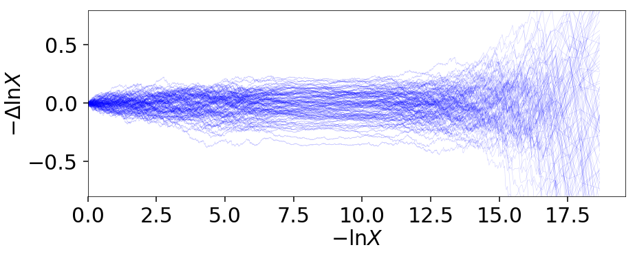
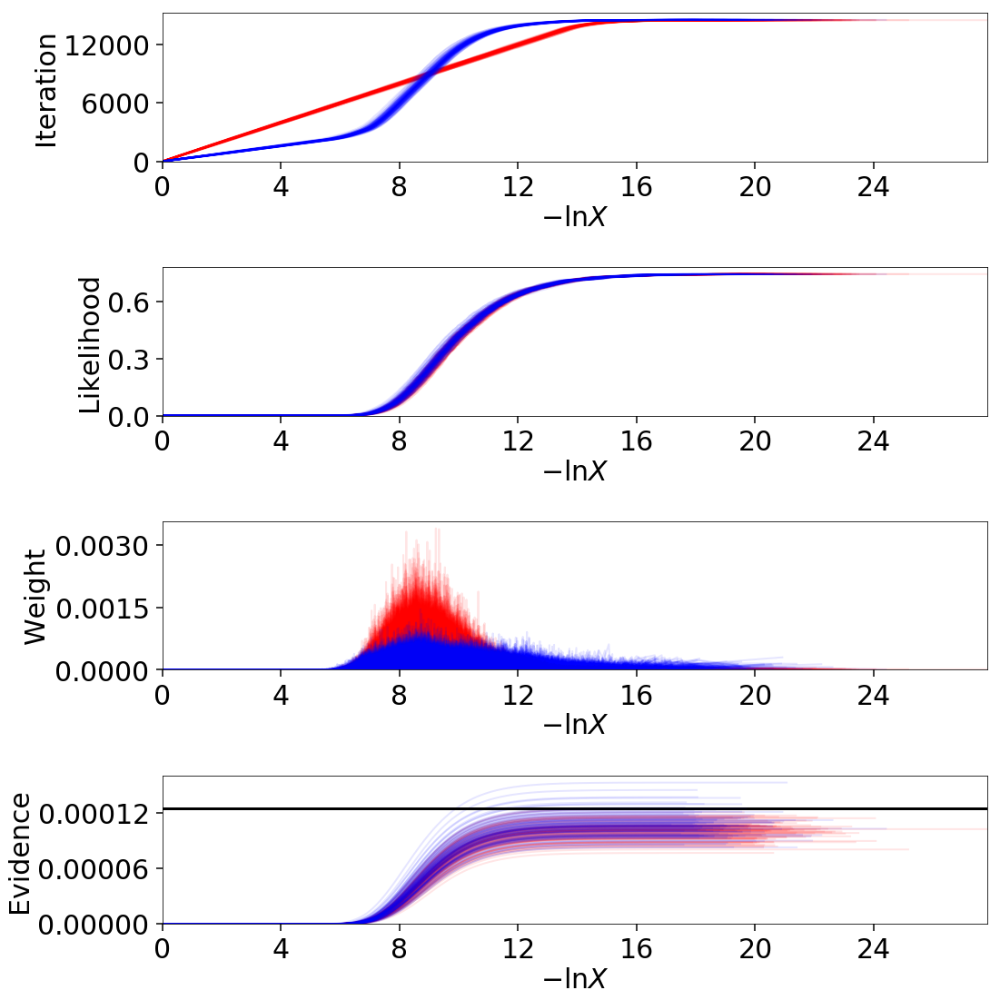
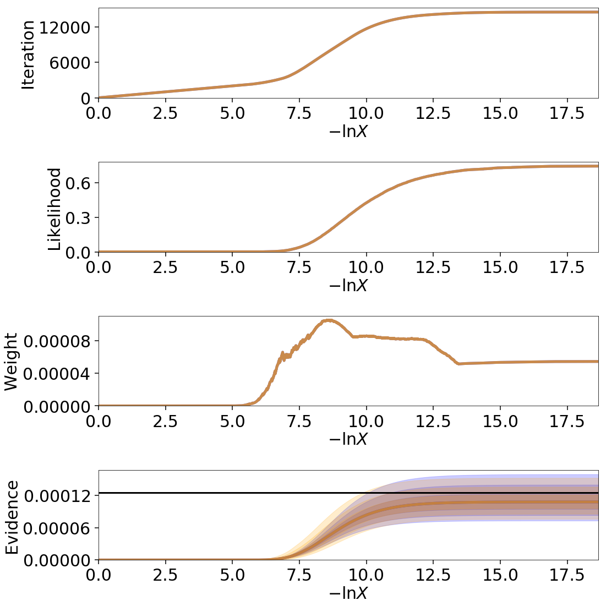
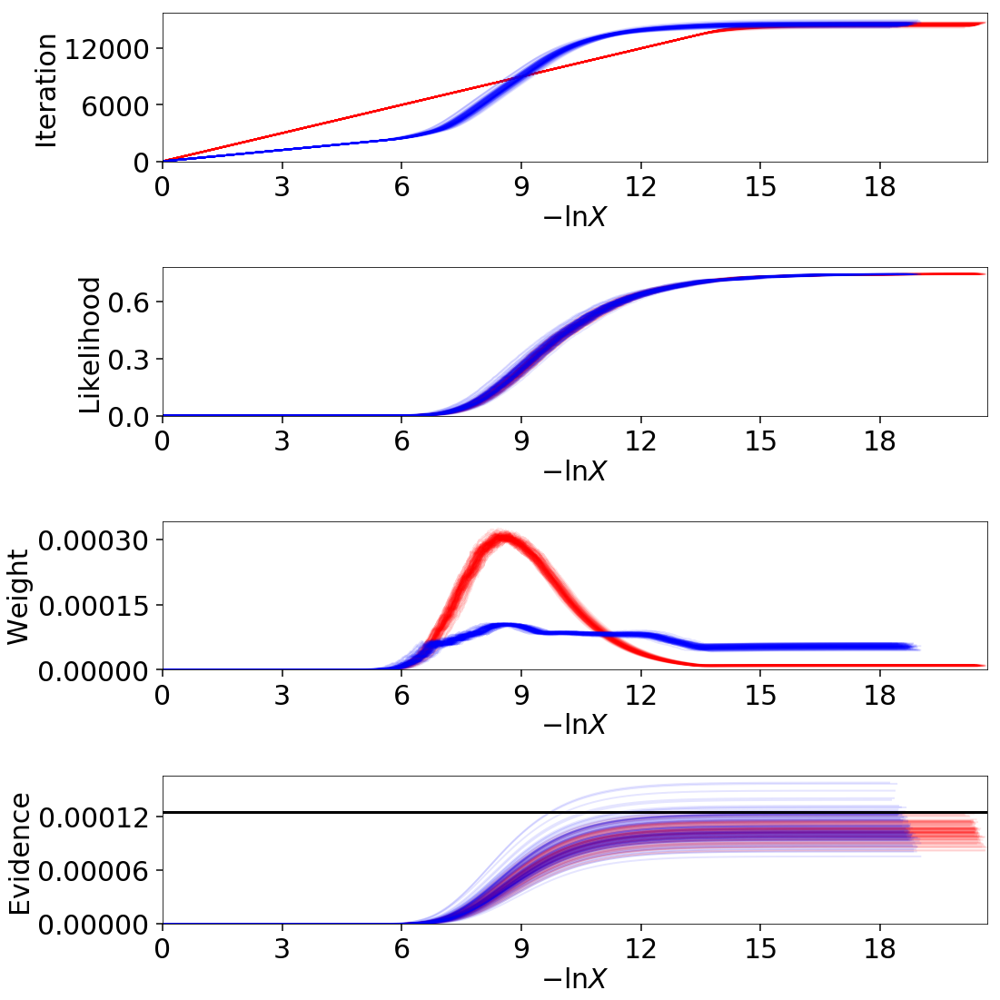
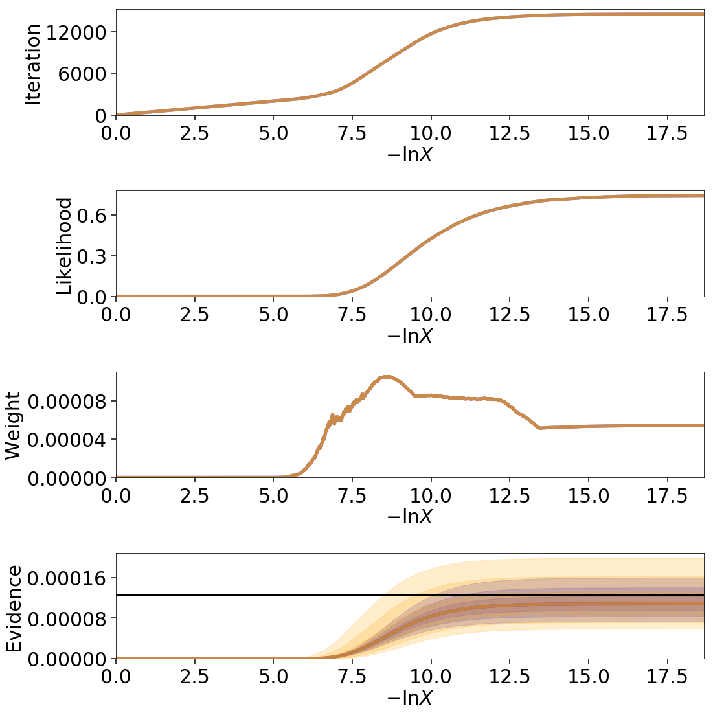
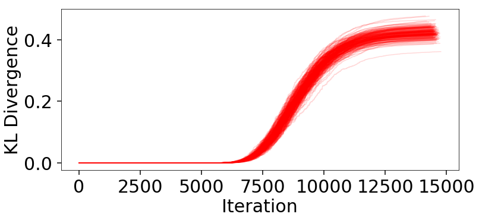
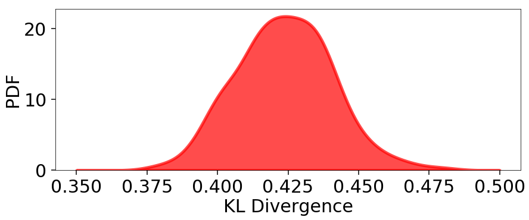
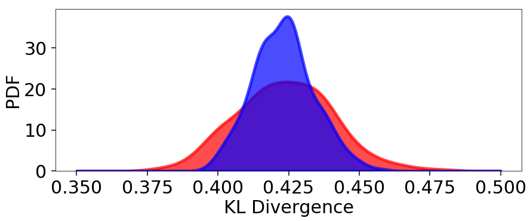

======================
Nested Sampling Errors
======================

Nested Sampling has two main sources of error. The first is the
**statistical errors** associated with uncertainties on the prior volume
:math:`X_i` at a given iteration :math:`i`. This leads to uncertainties on the
estimated log-evidence :math:`\ln \hat{\mathcal{Z}}` and the associated
posterior importance weights :math:`\hat{p}_i`. The second is the
**sampling errors** associated with replacing the integral over the parameters
:math:`\boldsymbol{\Theta}` of interest with a single sample
:math:`\boldsymbol{\Theta}_i` from the corresponding iso-likelihood contour
defined by :math:`\mathcal{L}(\boldsymbol{\Theta}) = \lambda_i`.

One of the neat features of Nested Sampling is that we are able to probe
these uncertainties **within the same run used to compute the results**. We 
exploit this fact within ``dynesty`` in two ways. The first is a set of
functions within `~dynesty.utils` that can inject these errors into Nested
Sampling `~dynesty.results.Results`. This allows users to compute realistic
error budgets without going through the tedious task of computing many Nested
Sampling runs. The second way is through the default Dynamic Nested Sampling
:meth:`~dynesty.dynamicsampler.stopping_function`, which uses this error budget
when deciding whether to stop adding samples.

This page will go through some of the main results associated with deriving
both exact and approximate error budgets for different aspects of Nested
Sampling and show how to implement them in ``dynesty``.

Approximate Evidence Errors
===========================

In a given Static Nested Sampling run with :math:`K` live points, the prior
volume evolves as:

.. math::
    \Delta \ln X \approx \frac{1}{K}

As mentioned in :ref:`Priors in Nested Sampling`, the
**"information"** gained from moving from the prior
:math:`\pi(\boldsymbol{\Theta})` to the posterior
:math:`P(\boldsymbol{\Theta})` can be quantified using the **KL Divergence**
between the two distributions:

.. math::

    H(P|\pi) \equiv \int_{\Omega_{\boldsymbol{\Theta}}} P(\boldsymbol{\Theta})
    \ln \frac{P(\boldsymbol{\Theta})}{\pi(\boldsymbol{\Theta})}
    \, d\boldsymbol{\Theta}

This can be re-written in terms of an integral over the prior volume as:

.. math::

    H = \frac{1}{\mathcal{Z}} \int_{0}^{1} \mathcal{L}(X) 
    \ln \mathcal{L}(X) \, dX - \ln \mathcal{Z}

where :math:`\mathcal{Z}` is the again the Bayesian evidence.

As such, the number of steps :math:`N` needed to integrate over the majority
of the posterior starting from the prior subject to some 
:math:`\Delta \ln \hat{\mathcal{Z}}` (see :ref:`Stopping Criteria`)
must scale with :math:`H`. We also know that :math:`N` 
should scale inversely with the typical
:math:`\Delta \ln X`. This gives us that the expected number of steps 
:math:`\mathbb{E}[N]` goes as

.. math::

    \mathbb{E}[N] \sim \frac{H}{\Delta \ln X}

Assuming that the number of steps follows a Poisson distribution, we then
expect the variance :math:`\mathbb{V}[N]` should also scale as

.. math::

    \mathbb{V}[N] \sim \frac{H}{\Delta \ln X}

Since the the prior volumes compress exponentially, the uncertainty on
:math:`N` leads to exponential uncertainty in :math:`X` (and hence
:math:`\mathcal{Z}`) at a given iteration, so this uncertainty actually
contributes in :math:`\ln \mathcal{Z}` rather than :math:`\mathcal{Z}`. The
rough uncertainty in :math:`\ln \mathcal{Z}` is then:

.. math::

    \sigma[\ln \hat{\mathcal{Z}}] \sim \sigma[\ln \hat{X}] \sim 
    \sigma[\ln N] \, \Delta \ln X = \sqrt{H \Delta \ln X}
    = \sqrt{\frac{H}{K}}

This approximation can be extended to Dynamic Nested Sampling runs by
exploiting the fact that

.. math::

    \mathbb{V}[\ln \hat{\mathcal{Z}}] = 
    \mathbb{V} \left[ \sum_{i=1}^{N} \left( \ln \hat{\mathcal{Z}}_i -
    \ln \hat{\mathcal{Z}}_{i-1} \right) \right] \equiv
    \mathbb{V} \left[ \sum_{i=1}^{N} \Delta \ln \hat{\mathcal{Z}}_i \right] 
    \approx \sum_{i=1}^{N} \mathbb{V}[\Delta \ln \hat{\mathcal{Z}}_i]

where we take :math:`\ln \hat{\mathcal{Z}}_0 = 0`. Approximating 
:math:`\mathbb{V}[\Delta \ln \hat{\mathcal{Z}_i}]` as

.. math::

    \mathbb{V}[\Delta \ln \hat{\mathcal{Z}}_i] \approx
    \mathbb{V}[\ln \hat{\mathcal{Z}}_i] - 
    \mathbb{V}[\ln \hat{\mathcal{Z}}_{i-1}]
    \sim H_i \Delta \ln X - H_{i-1} \Delta \ln X 
    \equiv \Delta H_i \Delta \ln X

shows that the contribution to the error at each iteration is based on the 
differential change in information :math:`\Delta H_i` multiplied by the
differential change in log-prior volume :math:`\Delta \ln X`, which we can
substitute with :math:`\Delta \ln X_i`. This gives us:

.. math::

    \mathbb{V}[\ln \hat{\mathcal{Z}}] \approx 
    \sum_{i=1}^{N} \Delta H_i \Delta \ln X_i \approx 
    \sum_{i=1}^{N} \frac{\Delta H_i}{K_i}

These are the errors that are returned by default in the output `~sys.stderr`
statements and output `~dynesty.results.Results` instances and used in
plotting functions.

As an example, here's a comparison among two different runs to showcase
how the approximate errors take into account varying numbers of live points
(and the associated changes in prior volume) throughout a given Nested Sampling
run::

    # static nested sampling
    sampler = dynesty.NestedSampler(loglikelihood, prior_transform, ndim,
                                    bound='single', nlive=1000)
    sampler.run_nested()
    res = sampler.results
    sys.stderr.write('\n')

    sampler.reset()
    sampler.run_nested(dlogz=0.01)
    res2 = sampler.results
    sys.stderr.write('\n')

    # dynamic nested sampling
    dsampler = dynesty.DynamicNestedSampler(loglikelihood, prior_transform,
                                            ndim, bound='single')
    dsampler.run_nested(maxiter=res2.niter+res2.nlive, use_stop=False)
    dres = dsampler.results

.. rst-class:: sphx-glr-script-out

Out::

    iter: 8973 | +1000 | bound: 8 | nc: 1 | ncall: 47632 | eff(%): 20.938 | 
    loglstar:   -inf < -0.300 <    inf | logz: -9.169 +/-  0.097 | 
    dlogz:  0.001 >  1.009
    iter: 13175 | +1000 | bound: 14 | nc: 1 | ncall: 54140 | eff(%): 26.182 | 
    loglstar:   -inf < -0.294 <    inf | logz: -8.852 +/-  0.084 | 
    dlogz:  0.000 >  0.010
    iter: 14175 | batch: 7 | bound: 35 | nc: 1 | ncall: 39494 | 
    eff(%): 35.892 | loglstar: -5.792 < -0.329 < -0.645 | 
    logz: -8.930 +/-  0.116 | stop:    nan

The differences among the results illustrate how the location where
samples are allocated can significantly affect the error budget, as discussed
in :ref:`Dynamic Nested Sampling`.

Statistical Uncertainties
=========================

This section deals primarily with the **statistical uncertainties** associated
with Nested Sampling. These arise from the probabilistic way a prior volume
:math:`X_i` is assigned to a particular sample :math:`\boldsymbol{\Theta}_i`
and iso-likelihood contour :math:`\mathcal{L}_i`.

Order Statistics
----------------

Nested Sampling works thanks to the "magic" of **order statistics**.
At the start of a Nested Sampling run, we sample :math:`K` 
points from the prior 
:math:`\pi(\boldsymbol{\Theta})` with likelihoods 
:math:`\lbrace \mathcal{L}_1, \dots, \mathcal{L}_{K} \rbrace` and associated 
prior volumes :math:`\lbrace X_1, \dots, X_K \rbrace`. We then want to pick the
point with the *smallest* (worst) likelihood :math:`\mathcal{L}_{(1)}` out of
the **ordered set** :math:`\lbrace \mathcal{L}_{(1)}, \dots, \mathcal{L}_{(K)}
\rbrace` from smallest to largest. These likelihoods correspond to an ordered
set of prior volumes :math:`\lbrace X_{(1)}, \dots, X_{(K)} \rbrace`, where the
likelihoods and prior volumes are inversely ordered such that
:math:`\mathcal{L}_{(i)} \leftrightarrow X_{(K-i+1)}`.

What is this prior volume? Since all the points were drawn from the prior,
the `probability integral transform (PIT)
<https://en.wikipedia.org/wiki/Probability_integral_transform>`_ tells us that
the corresponding prior volumes are uniformly distributed **random variables**
such that

.. math::

    X_1, \dots, X_K \stackrel{i.i.d.}{\sim} \textrm{Unif}

where :math:`\textrm{Unif}` is the standard Uniform distribution. It can be
shown through the `Renyi representation 
<http://homepages.math.uic.edu/~wangjing/stat416/orderstat-exp1.pdf>`_ (and
other methods) that the set of *ordered* uniform random variables (the prior
volumes) can be *jointly* represented by :math:`K+1` standard Exponential 
random variables

.. math::

    X_{(j)} \sim \frac{Y_1 + \cdots + Y_j}{Y_1 + \cdots + Y_{K+1}}

.. math::

    Y_1,\dots,Y_{K+1} \stackrel{i.i.d.}{\sim} \textrm{Expo}

where :math:`\textrm{Expo}` is the standard Exponential distribution.

Prior Volumes and Order Statistics
----------------------------------

Constant Number of Live Points
^^^^^^^^^^^^^^^^^^^^^^^^^^^^^^

The marginal distribution of the prior volume :math:`X_{(K)}` associated with
the live point with the lowest likelihood :math:`\mathcal{L}_{(1)}` is

.. math::

    X_{(j=K)} \sim \textrm{Beta}(j, K-j+1) = \textrm{Beta}(K, 1)

where :math:`\textrm{Beta}(\alpha, \beta)` is the Beta distribution with
concentration parameters :math:`(\alpha, \beta)`.

Once we replace a live point with a new live point drawn from the prior with
:math:`\mathcal{L}_i \geq \mathcal{L}_{(1)}`, we now want to do the same
procedure again. Using the same logic as above, we know that our prior volumes
must be independently and identically (i.i.d.) uniformly distributed 
*within the previous volume* since we just replaced the worst point with a new
independent draw. At a given iteration :math:`i` the prior volume associated
of the live point with the worst likelihood is then

.. math::

    X_i = t_i X_{i-1}

.. math::

    t_i \sim \textrm{Beta}(K, 1)

This means that we're compressing by a factor of 
:math:`\mathbb{E}[t_i] = K/(K+1)` at each iteration. This result allows us to
*simulate* the change in prior volume using numerical methods such as
`numpy.random.beta`.

Increasing Number of Live Points
^^^^^^^^^^^^^^^^^^^^^^^^^^^^^^^^

In the Dynamic Nested Sampling case at a given iteration we can add in new 
live points so that the number of effective live points :math:`K_i > K_{i-1}`.
Since all the samples are i.i.d. by construction, we end up with the
modified result

.. math::

    t_i \sim \textrm{Beta}(K_i, 1) ~ , \quad K_i \geq K_{i-1}

Decreasing Number of Live Points
^^^^^^^^^^^^^^^^^^^^^^^^^^^^^^^^

In the case where the number of live points are decreasing, we are now directly
sampling "down" the set of order statistics
:math:`\lbrace X_{(1)}, \dots, X_{(K_j)} \rbrace` described above. If at
iteration :math:`i > j` we have :math:`K_i < K_{i+1} < \dots < K_j` live
points, then the prior volume is the :math:`X_{(K_i)}`-th order statistic.
Relative to :math:`X_j`, these have an expectation value of:

.. math::

    \mathbb{E} \left[ \frac{\sum_{n=1}^{K_i} Y_{n}}{\sum_{n=1}^{K_j+1} Y_{n}}
    \right] = \frac{K_j - K_i + 1}{K_j + 1}

This leads to the prior volume changing in discrete "chunks" of
:math:`X_j/(K_j+1)`. In the :ref:`Static Nested Sampling` case, this only
occurs at the end when adding the final set of live points. In the 
:ref:`Dynamic Nested Sampling` case, however, the changes in prior volume from
iteration to iteration can swap back and forth between **exponential**
and **uniform** shrinkage.

We can simulate the joint distribution of these prior volumes by identifying
contiguous sequences of strictly decreasing live points and then simulating
random numbers using `numpy.random.exponential`.

Jittering Runs
--------------

``dynesty`` contains a variety of useful utilities in the `~dynesty.utils`
module, some of which were demonstrated in :ref:`Getting Started`. In addition
to those, it also contains several functions that operate over the output
`~dynesty.results.Results` dictionary from a Nested Sampling run
that implement the results discussed on this page.

The :meth:`~dynesty.utils.jitter_run` function probes the statistical
uncertainties in Nested Sampling by drawing a large number of random variables
from the corresponding (joint) prior volume distributions described above 
in order to simulate the set of possible prior volumes associated with each
dead point. It then returns a new `~dynesty.results.Results` dictionary with a
new set of prior volumes, importance weights, and evidences (with new errors).
This approach of adding "jitter" to the weights works for both Static and
Dynamic Nested Sampling runs and can capture complex covariance structure.

Let's go through an example using the results from
:ref:`Approximate Evidence Errors`. First, let's examine what the
distribution of possible prior volumes looks like::

    from dynesty import utils as dyfunc

    # plot ln(prior volume) changes
    for i in range(100):
        dres_j = dyfunc.jitter_run(dres)
        plt.plot(-dres.logvol, -dres.logvol + dres_j.logvol, color='blue', 
                 lw=0.5, alpha=0.2)
    plt.ylim([-0.8, 0.8])
    plt.xlabel(r'$-\ln X$')
    plt.ylabel(r'$- \Delta \ln X$')

How do these realizations compare with our evidence approximation? We can 
compare them directly::

    import copy

    # compute ln(evidence) error
    lnzs = np.zeros((100, len(dres.logvol)))
    for i in range(100):
        dres_j = dyfunc.jitter_run(dres)
        lnzs[i] = np.interp(-dres.logvol, -dres_j.logvol, dres_j.logz)
    lnzerr = np.std(lnzs, axis=0)

    # plot comparison
    dres_j = copy.deepcopy(dres)
    dres_j['logzerr'] = lnzerr
    fig, axes = dyplot.runplot(dres, color='blue')
    fig, axes = dyplot.runplot(dres_j, color='orange', 
                               lnz_truth=lnz_truth, truth_color='black',
                               fig=(fig, axes))
    fig.tight_layout()

.. image:: ../images/errors_003.png
    :align: center

While the analytic evidence approximations tend to underestimate the error
while sampling within the typical set, the final errors are almost identical.

Finally, let's just plot a number of realizations directly to get a sense of
how changes to the prior volumes propagate through to other quantities::

    # overplot draws on summary plots
    fig, axes = plt.subplots(4, 1, figsize=(16, 16))
    for i in range(100):
        res2_j = dyfunc.jitter_run(res2)
        fig, axes = dyplot.runplot(res2_j, color='red',
                                   plot_kwargs={'alpha': 0.1, 'linewidth': 2},
                                   mark_final_live=False, lnz_error=False,
                                   fig=(fig, axes))
    for i in range(100):
        dres_j = dyfunc.jitter_run(dres)
        fig, axes = dyplot.runplot(dres_j, color='blue',
                                   plot_kwargs={'alpha': 0.1, 'linewidth': 2},
                                   mark_final_live=False, lnz_error=False,
                                   lnz_truth=lnz_truth, truth_color='black',
                                   truth_kwargs={'alpha': 0.1},
                                   fig=(fig, axes))
    fig.tight_layout()

Sampling Uncertainties
======================

In addition to the statistical uncertainties associated with the unknown prior
volumes, Nested Sampling is also subject to **sampling uncertainties** due to
the **"path"** taken by a particular live point through the prior. This
encompasses two different sources of error intrinsic to sampling itself. The
first is **Monte Carlo noise** that arises from probing a continuous
distribution using a finite set of samples. The second is **path-dependency**,
where the results depend on the particular paths taken by the set of particles.
This affects the results since the number of positions sampled along each path
is subject to Poisson noise (see :ref:`Approximate Evidence Errors`); positions
can be correlated in some way rather than fully independent draws from the
target distribution, subtly violating the sampling assumptions in Nested 
Sampling.

In other words, although the prior volume :math:`X_i` at a given iteration 
:math:`i` might be known exactly, the particular *position* 
:math:`\boldsymbol{\Theta}_i` on the iso-likelihood contour
:math:`\mathcal{L}_i` is randomly distributed. This adds some additional noise
to our posterior and evidence estimates. This can also complicate things
if there are problems with the live point proposals that violate the
assumptions described in :ref:`Nested Sampling`.

Unraveling/Merging Runs
-----------------------

One way to interpret Nested Sampling is that it is a scheme that takes a set of
ordered likelihoods :math:`0 < \mathcal{L}_1 < \dots < \mathcal{L}_N` and
associates them with a set of corresponding prior volumes
:math:`1 > X_1 > \dots > X_N > 0` by means of a number of live points.

One neat property of Nested Sampling is that if we have two Static Nested
Sampling runs with :math:`K_1` and :math:`K_2` live points, respectively,
composed of two sets of ordered likelihoods 
:math:`0 < \mathcal{L}_{(1)}^{(K_1)} < \dots < \mathcal{L}_{(N)}^{(K_1)}` and
:math:`0 < \mathcal{L}_{(1)}^{(K_2)} < \dots < \mathcal{L}_{(N)}^{(K_2)}`,
the combined set of ordered likelihoods has the same properties as the set of
ordered likelihoods associated with a run using :math:`K_1+K_2` live points!

This property can be directly extended to **merge** any combination of
:math:`M` Static Nested Sampling runs. It can also be applied in reverse to
**unravel** a run with :math:`K` live points into :math:`K` runs with a single
live point. These **"strands"** form the base unit of a Nested Sampling run.

This "trivially parallelizable" property of Static Nested Sampling can also be
directly extended to Dynamic Nested Sampling runs over where strands/batches
are added over different likelihood ranges. For instance, combining two runs
with :math:`K_1` and :math:`K_2` live points from 
:math:`\mathcal{L}_\min^{(K_1)} < \mathcal{L}_\min^{(K_2)} < 
\mathcal{L}_\max^{(K_2)} < \mathcal{L}_\max^{(K_1)}` is equivalent to a 
Dynamic Nested Sampling run with :math:`K_1+K_2` live points between 
:math:`\mathcal{L}_\min^{(K_2)} < \mathcal{L}_\max^{(K_2)}` and :math:`K_1`
elsewhere.

This process of unraveling/merging Nested Sampling runs can be done using the
:meth:`~dynesty.utils.unravel_run` and :meth:`~dynesty.utils.merge_runs` 
functions. Both functions work with Static and Dynamic Nested Sampling results,
although some of the provided anciliary quantities are not always valid. Their
usage is straightforward::

    res_list = dyfunc.unravel_run(res)  # unravel run into strands
    res_merge = dyfunc.merge_runs(res_list)  # merge strands

**Note that these functions are mostly included for completeness
and are not intended for heavy use in most practical applications.**

Bootstrapping Runs
------------------

In theory, to properly incorporate these sampling errors we have to marginalize
over all possible paths particles can take through the distribution. In
practice, however, we can approximate the set of all possible paths
using the discrete set of paths taken from the set of :math:`K` particles (live
points) in a given run. By bootstrap resampling a new set of :math:`K` strands
(paths) from the current set of :math:`K` live points, we are able to construct
a new **"resampled" run** that probes these intrinsic sampling uncertainties.
This both allows us to probe Poisson noise in the number of total steps
:math:`N` as well as the particular path-dependencies of the set of particles.

There is one small caveat to this result. When the number of live points
remains constant, there is a symmetry in the information content provided by
each strand: since all points are initialized from the prior
:math:`\pi(\boldsymbol{\Theta})`, they provide information on the prior volume
:math:`X` at a given iteration, allowing for both evidence estimation and
posterior inference. Adding live points dynamically, however, can break this
symmetry since not all strands are initialized starting from the prior: while
these provide *relative* information useful for posterior inference, they are
useless for evidence estimation. Since these two sets of "baseline" and
"add-on" strands have qualitatively different properties, we use a stratified
bootstrap to preserve their relative contributions to the final set of results.

The :meth:`~dynesty.utils.resample_run` function implements the bootstrap
resampling approach. It then returns a new `~dynesty.results.Results`
dictionary with a new set of samples and associated quantities.

Let's use the same examples as :ref:`Jittering Runs` to demonstrate it's
usage. First, we will examine how these realizations compare with the original
analytic evidence approximation::

    # compute ln(evidence) error
    lnzs = np.zeros((100, len(dres.logvol)))
    for i in range(100):
        dres_r = dyfunc.resample_run(dres)
        lnzs[i] = np.interp(-dres.logvol, -dres_r.logvol, dres_r.logz)
    lnzerr = np.std(lnzs, axis=0)

    # plot comparison
    dres_r = copy.deepcopy(dres)
    dres_r['logzerr'] = lnzerr
    fig, axes = dyplot.runplot(dres, color='blue')
    fig, axes = dyplot.runplot(dres_r, color='orange', 
                               lnz_truth=lnz_truth, truth_color='black',
                               fig=(fig, axes))
    fig.tight_layout()

The final errors are again almost identical.

Now let's just plot a number of realizations directly to get a sense of
how our (stratified) bootstrap affects other quantities::

    # overplot draws on summary plots
    fig, axes = plt.subplots(4, 1, figsize=(16, 16))
    for i in range(100):
        res2_r = dyfunc.resample_run(res2)
        fig, axes = dyplot.runplot(res2_r, color='red',
                                   plot_kwargs={'alpha': 0.1, 'linewidth': 2},
                                   mark_final_live=False, lnz_error=False,
                                   fig=(fig, axes))
    for i in range(100):
        dres_r = dyfunc.resample_run(dres)
        fig, axes = dyplot.runplot(dres_r, color='blue',
                                   plot_kwargs={'alpha': 0.1, 'linewidth': 2},
                                   mark_final_live=False, lnz_error=False,
                                   lnz_truth=lnz_truth, truth_color='black',
                                   truth_kwargs={'alpha': 0.1},
                                   fig=(fig, axes))
    fig.tight_layout()

Uncertainty Estimates in Practice
=================================

Let's examine the behavior using the same examples as
shown in :ref:`Jittering Runs` and :ref:`Bootstrapping Runs`.

.. code-block:: python

    # compute ln(evidence) error
    lnzs = np.zeros((100, len(dres.logvol)))
    for i in range(100):
        dres_s = dyfunc.simulate_run(dres)
        lnzs[i] = np.interp(-dres.logvol, -dres_s.logvol, dres_s.logz)
    lnzerr = np.std(lnzs, axis=0)

    # plot comparison
    dres_s = copy.deepcopy(dres)
    dres_s['logzerr'] = lnzerr
    fig, axes = dyplot.runplot(dres, color='blue')
    fig, axes = dyplot.runplot(dres_s, color='orange', 
                               lnz_truth=lnz_truth, truth_color='black',
                               fig=(fig, axes))
    fig.tight_layout()

.. code-block:: python

    # overplot draws on summary plots
    fig, axes = plt.subplots(4, 1, figsize=(16, 16))
    for i in range(100):
        res2_s = dyfunc.simulate_run(res2)
        fig, axes = dyplot.runplot(res2_s, color='red',
                                   plot_kwargs={'alpha': 0.1, 'linewidth': 2},
                                   mark_final_live=False, lnz_error=False,
                                   fig=(fig, axes))
    for i in range(100):
        dres_s = dyfunc.simulate_run(dres)
        fig, axes = dyplot.runplot(dres_s, color='blue',
                                   plot_kwargs={'alpha': 0.1, 'linewidth': 2},
                                   mark_final_live=False, lnz_error=False,
                                   lnz_truth=lnz_truth, truth_color='black',
                                   truth_kwargs={'alpha': 0.1},
                                   fig=(fig, axes))
    fig.tight_layout()

.. image:: ../images/errors_008.png

Validation Against Repeated Runs
================================

As a quick demonstration of usage, we check the fidelity of these results 
against a set a repeated Nested Sampling runs:

.. code-block:: python

    # generate repeat nested sampling runs
    Nrepeat = 500
    repeat_res = []
    dsampler = dynesty.DynamicNestedSampler(loglikelihood, prior_transform,
                                            ndim, bound='single')

    for i in range(Nrepeat):
        dsampler.reset()
        dsampler.run_nested(print_progress=False, maxiter=5000, use_stop=False)
        repeat_res.append(dsampler.results)

.. code-block:: python

    # establish our comparison run
    dsampler.reset()
    dsampler.run_nested(print_progress=False, maxiter=5000, use_stop=False)
    r = dsampler.results

    # generate jittered runs
    sim_res = []
    for i in range(Nrepeat):
        sim_res.append(dyfunc.jitter_run(r))

    # generate resampled runs
    rsamp_res = []
    for i in range(Nrepeat):
        rsamp_res.append(dyfunc.resample_run(r))

As an initial test, we can compare the estimated :math:`\ln \hat{\mathcal{Z}}`
from each set of runs:

.. code-block:: python

    # compare evidence estimates

    # analytic first-order approximation
    lnz_mean, lnz_std = r.logz[-1], r.logzerr[-1]
    print('Approx.:     {:6.3f} +/- {:6.3f}'.format(lnz_mean, lnz_std))

    # jittered draws
    lnz_arr = [results.logz[-1] for results in jitter_res]
    lnz_mean, lnz_std = np.mean(lnz_arr), np.std(lnz_arr)
    print('Sim.:        {:6.3f} +/- {:6.3f}'.format(lnz_mean, lnz_std))

    # resampled draws
    lnz_arr = [results.logz[-1] for results in rsamp_res]
    lnz_mean, lnz_std = np.mean(lnz_arr), np.std(lnz_arr)
    print('Resamp.:     {:6.3f} +/- {:6.3f}'.format(lnz_mean, lnz_std))

    # repeated runs
    lnz_arr = [results.logz[-1] for results in repeat_res]
    lnz_mean, lnz_std = np.mean(lnz_arr), np.std(lnz_arr)
    print('Repeat: {:6.3f} +/- {:6.3f}'.format(lnz_mean, lnz_std))

.. rst-class:: sphx-glr-script-out

Out::

    Approx.:     -8.670 +/-  0.207
    Sim.:        -8.696 +/-  0.192
    Resamp.:     -8.676 +/-  0.180
    Repeat:      -8.912 +/-  0.211

We find the approximate, simulated, and resampled uncertainties show relatively
good agreement.

We can also compare the first and second moments of the posterior:

.. code-block:: python

    # compare posterior first moments

    # jittered draws
    x_arr = np.array([dyfunc.mean_and_cov(results.samples, 
                      weights=np.exp(results.logwt))[0]
                      for results in jitter_res])
    x_mean = np.round(np.mean(x_arr, axis=0), 3)
    x_std = np.round(np.std(x_arr, axis=0), 3)
    print('Sim.:        {0} +/- {1}'.format(x_mean, x_std))

    # resampled draws
    x_arr = np.array([dyfunc.mean_and_cov(results.samples, 
                      weights=np.exp(results.logwt))[0]
                      for results in rsamp_res])
    x_mean = np.round(np.mean(x_arr, axis=0), 3)
    x_std = np.round(np.std(x_arr, axis=0), 3)
    print('Resamp.:     {0} +/- {1}'.format(x_mean, x_std))

    # repeated runs
    x_arr = np.array([dyfunc.mean_and_cov(results.samples, 
                      weights=np.exp(results.logwt))[0]
                      for results in repeat_res])
    x_mean = np.round(np.mean(x_arr, axis=0), 3)
    x_std = np.round(np.std(x_arr, axis=0), 3)
    print('Rep. (mean): {0} +/- {1}'.format(x_mean, x_std))

.. rst-class:: sphx-glr-script-out

Out::

    Sim.:        [-0.022 -0.022 -0.021] +/- [0.016 0.016 0.016]
    Resamp.:     [-0.023 -0.023 -0.022] +/- [0.016 0.017 0.017]
    Repeat:      [ 0.002  0.002  0.002] +/- [0.016 0.016 0.016]

.. code-block:: python

    # compare posterior second (diagonal) moments

    # jittered draws
    x_arr = np.array([dyfunc.mean_and_cov(results.samples, 
                      weights=np.exp(results.logwt))[1]
                      for results in jitter_res])
    x_arr = [np.diag(x) for x in x_arr]
    x_mean = np.round(np.mean(x_arr, axis=0), 3)
    x_std = np.round(np.std(x_arr, axis=0), 3)
    print('Sim.:        {0} +/- {1}'.format(x_mean, x_std))

    # resampled draws
    x_arr = np.array([dyfunc.mean_and_cov(results.samples, 
                      weights=np.exp(results.logwt))[1]
                      for results in rsamp_res])
    x_arr = [np.diag(x) for x in x_arr]
    x_mean = np.round(np.mean(x_arr, axis=0), 3)
    x_std = np.round(np.std(x_arr, axis=0), 3)
    print('Resamp.:     {0} +/- {1}'.format(x_mean, x_std))

    # repeated runs
    x_arr = np.array([dyfunc.mean_and_cov(results.samples, 
                      weights=np.exp(results.logwt))[1]
                      for results in repeat_res])
    x_arr = [np.diag(x) for x in x_arr]
    x_mean = np.round(np.mean(x_arr, axis=0), 3)
    x_std = np.round(np.std(x_arr, axis=0), 3)
    print('Rep. (mean): {0} +/- {1}'.format(x_mean, x_std))

.. rst-class:: sphx-glr-script-out

Out::

    Sim.:        [1.041 1.038 1.046] +/- [0.026 0.026 0.026]
    Resamp.:     [1.039 1.035 1.044] +/- [0.026 0.026 0.027]
    Repeat:      [0.994 0.994 0.993] +/- [0.026 0.026 0.026]

Our simulated and resampled uncertainties seem to do an excellent job of capturing the
intrinsic uncertainties in both the mean and the standard deviation here.

Posterior Uncertainties
=======================

As discussed in :ref:`How Many Samples are Enough?`, it can be difficult to
determine how many samples are needed to guarantee the posterior density
estimate :math:`\hat{P}(\boldsymbol{\Theta})` constructed from the set of
samples :math:`\left\lbrace \boldsymbol{\Theta}_1, \dots, \boldsymbol{\Theta}_N
\right\rbrace` is a "good" approximation to the true posterior density
:math:`P(\boldsymbol{\Theta})`. One way of getting a handle on this is to 
measure the "difference" between the two distributions using the KL divergence:

.. math::

    H(\hat{P}|P) \equiv \int_{\Omega_{\boldsymbol{\Theta}}}
    \hat{P}(\boldsymbol{\Theta})
    \ln\frac{\hat{P}(\boldsymbol{\Theta})}{P(\boldsymbol{\Theta})} \,
    d\boldsymbol{\Theta}

Since we do not know :math:`P(\boldsymbol{\Theta})`, we can substitute 
:math:`\hat{P} \rightarrow \hat{P}^\prime` and :math:`P \rightarrow \hat{P}`
to construct an empirical estimate of this quantity based on realizations of 
:math:`\hat{P}(\boldsymbol{\Theta})`:

.. math::

    H(\hat{P}^\prime|\hat{P}) = \int_{\Omega_{\boldsymbol{\Theta}}}
    \hat{P}^\prime(\boldsymbol{\Theta})
    \ln\frac{\hat{P}^\prime(\boldsymbol{\Theta})}{\hat{P}(\boldsymbol{\Theta})}
    \, d\boldsymbol{\Theta} = \sum_i \hat{p}_i^\prime \, \left(
    \ln \hat{p}_i^\prime - \ln \hat{p}_i \right)

KL divergences between (realizations of) Nested Sampling runs can be computed
in ``dynesty`` using the
:meth:`~dynesty.utils.kld_error` functions. 
Let's examine the results from the Static Nested
Sampling run used above to get a sense of what these look like::

    # compute KL divergences
    klds = []
    for i in range(Nrepeat):
        kld = dyfunc.kld_error(res2, error='jitter')
        klds.append(kld)

    # plot (cumulative) KL divergences
    plt.figure(figsize=(12, 5))
    for kld in klds:
        plt.plot(kld, color='red', alpha=0.15)
    plt.xlabel('Iteration')
    plt.ylabel('KL Divergence');

The behavior appears qualitatively similar to our evidence results, since the
majority of the KL divergence is coming from integrating over the bulk of the
posterior mass in the typical set. The variation in these results are plotted
below::

    from scipy.stats import gaussian_kde

    # compute KLD kernel density estimate
    kl_div = [kld[-1] for kld in klds]
    kde = gaussian_kde(kl_div)

    # plot results
    plt.figure(figsize=(10, 4))
    x = np.linspace(0.35, 0.5, 1000)
    plt.fill_between(x, kde.pdf(x), color='red', alpha=0.7, lw=5)
    plt.ylim([0., None])
    plt.xlabel('KL Divergence')
    plt.ylabel('PDF')

    # summarize results
    kl_div_mean, kl_div_std = np.mean(kl_div), np.std(kl_div)
    print('Mean:   {:6.3f}'.format(kl_div_mean))
    print('Std:    {:6.3f}'.format(kl_div_std))
    print('Std(%): {:6.3f}'.format(kl_div_std / kl_div_mean * 100.))

.. rst-class:: sphx-glr-script-out

Out::

    Mean:    0.425
    Std:     0.016
    Std(%):  3.833

Our Dynamic Nested Sampling run contains the same number of samples but 
preferentially places them around the typical set to improve posterior
estimation. The corresponding results are shown below for comparison::

    klds2 = []
    for i in range(Nrepeat):
        kld2 = dyfunc.kld_error(dres)
        klds2.append(kld2)

    # compute KLD kernel density estimate
    kl_div2 = [kld2[-1] for kld2 in klds2]
    kde2 = gaussian_kde(kl_div2)

    # plot results
    plt.figure(figsize=(14, 5))
    plt.fill_between(x, kde.pdf(x), color='red', alpha=0.7, lw=5)
    plt.fill_between(x, kde2.pdf(x), color='blue', alpha=0.7, lw=5)
    plt.ylim([0., None])
    plt.xlabel('KL Divergence')
    plt.ylabel('PDF')

    # summarize results
    kl_div2_mean, kl_div2_std = np.mean(kl_div2), np.std(kl_div2)
    print('Mean:   {:6.3f}'.format(kl_div2_mean))
    print('Std:    {:6.3f}'.format(kl_div2_std))
    print('Std(%): {:6.3f}'.format(kl_div2_std / kl_div2_mean * 100.))

.. rst-class:: sphx-glr-script-out

Out::

    Mean:    0.423
    Std:     0.012
    Std(%):  2.909

We see that although the mean KL divergence is similar, the fractional
variation around the mean is smaller.
