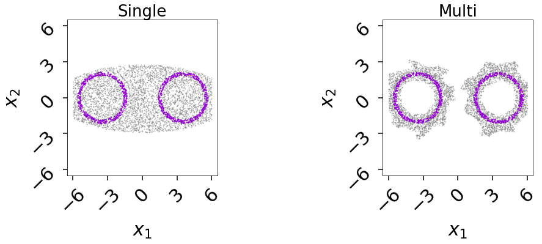
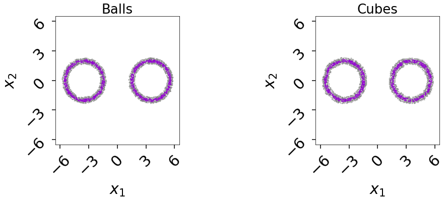
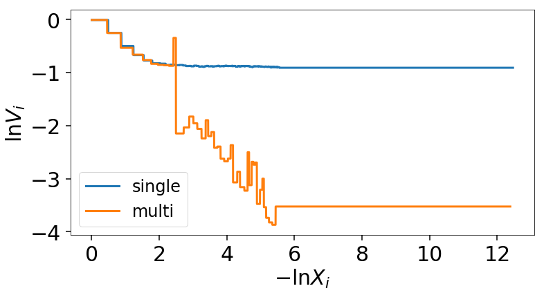
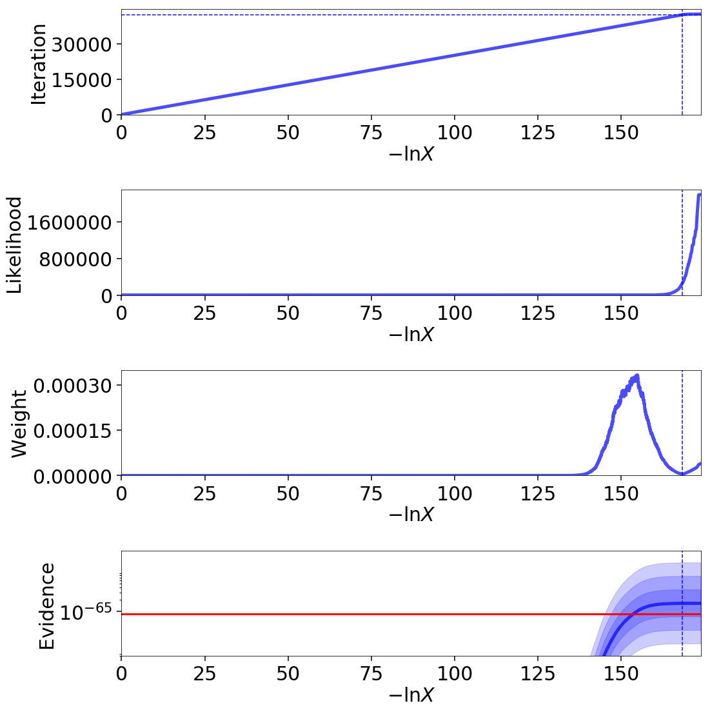
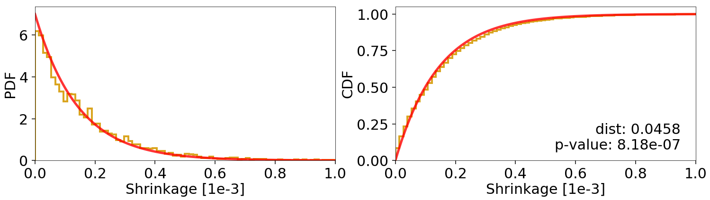

========
Examples
========

This page contains several examples on how ``dynesty`` can be used in practice,
illustrating both simple and more advanced aspects of the code.

Gaussian Shells
===============

A target distribution that helps test a variety of features in ``dynesty``.

The likelihood is parameterized by two shells:

.. math:: 
   \mathcal{L}(\theta) = \mathrm{circ}(\theta; c_1, r_1, w_1) +
                         \mathrm{circ}(\theta; c_2, r_2, w_2)

where each shell is represented by the "circ" function:
 
.. math::
   \mathrm{circ}(\theta; c, r, w) = \frac{1}{\sqrt{2 \pi w^2}}
       \exp \left[ - \frac{(|\theta - c| - r)^2}{2 w^2} \right]

Our shells will have a radius of :math:`r=2` and a width of :math:`w=0.1` and 
our prior will be uniform from :math:`[-6, 6)`::

    import numpy as np
    import time
    import sys
    from numpy.random import RandomState

    # defining constants
    r = 2.  # radius
    w = 0.1  # width
    c1 = np.array([-3.5, 0.])  # center of shell 1
    c2 = np.array([3.5, 0.])  # center of shell 2
    const = math.log(1. / math.sqrt(2. * math.pi * w**2))  # normalization

    # log-likelihood of a single shell
    def logcirc(theta, c):
        d = np.sqrt(np.sum((theta - c)**2, axis=-1))  # |theta - c|
        return const - (d - r)**2 / (2. * w**2)

    # log-likelihood of two shells
    def loglike(theta):
        return np.logaddexp(logcirc(theta, c1), logcirc(theta, c2))

    # our prior transform
    def prior_transform(x):
        return 12. * x - 6.

    rstate = RandomState(0)

Using a fine grid, we can visualize this distribution::

    from matplotlib import pyplot as plt

    # compute likelihood surface over a 2-D grid
    xx, yy = np.meshgrid(np.linspace(-6., 6., 200), np.linspace(-6., 6., 200))
    L = np.exp(loglike(np.dstack((xx, yy))))

    # plot result
    fig = plt.figure(figsize=(6,5))
    plt.scatter(xx, yy, c=L, s=0.5)
    plt.xlabel(r'$x$')
    plt.ylabel(r'$y$')
    plt.colorbar(label=r'$\mathcal{L}$');

.. image:: ../images/examples_shells_001.png
    :align: center

Bounding Tests
--------------

Let's test out our bounding options (with uniform sampling) on these 2-D
shells. To illustrate their baseline effectiveness, we will also disable the
initial delay before our first update.

.. code-block:: python

    import dynesty

    # bounding methods
    bounds = ['none', 'single', 'multi', 'balls', 'cubes']

    # run over each method and collect our results
    bounds_res = []
    for b in bounds:
        sampler = dynesty.NestedSampler(loglike, prior_transform, ndim=2,
                                        bound=b, sample='unif', nlive=1000,
                                        first_update={'min_ncall': -np.inf,
                                                      'min_eff': np.inf})
        sys.stderr.flush()
        t0 = time.time()
        sampler.run_nested(dlogz=0.1)
        t1 = time.time()
        res = sampler.results
        res['time'] = t1 - t0
        sys.stderr.flush()

.. rst-class:: sphx-glr-script-out

Out::

    iter: 5477+1000 | bound: 1 | nc: 1 | ncall: 256453 | eff(%):  2.526 | 
    logz: -1.738 +/-  0.048 | dlogz:  0.000 <  0.100    
    15.0276789665s

    iter: 5561+1000 | bound: 153 | nc: 1 | ncall: 100603 | eff(%):  6.522 | 
    logz: -1.822 +/-  0.049 | dlogz:  0.000 <  0.100    
    17.8634729385s

    iter: 5480+1000 | bound: 42 | nc: 1 | ncall: 26204 | eff(%): 24.729 | 
    logz: -1.742 +/-  0.048 | dlogz:  0.000 <  0.100    
    120.610301018s

    iter: 5419+1000 | bound: 34 | nc: 1 | ncall: 21095 | eff(%): 30.429 | 
    logz: -1.680 +/-  0.048 | dlogz:  0.000 <  0.100    
    292.094324112s

    iter: 5484+1000 | bound: 34 | nc: 1 | ncall: 21406 | eff(%): 30.291 | 
    logz: -1.745 +/-  0.048 | dlogz:  0.000 <  0.100    
    258.388988972s

We can see the amount of overhead associated with `'multi'`, `'cubes'`, and
`'balls'` is non-trivial in this case. For `'multi'`, most of this overhead
comes from the computational cost of *updating* our bounding distribution: 
multi-ellipsoidal decompositions are relatively expensive (especially given we 
repeat this process with bootstrap resampling to compute correction factors). 
For `'cubes'` and `'balls'`, on the other hand, the overhead mainly comes 
from *sampling* from our bouding distributions, since accepting or rejecting a 
point requires counting all neighbors within some radius :math:`r`, leading to 
frequent nearest-neighbor searches. `dynesty` utilizes `KDTrees 
<https://en.wikipedia.org/wiki/K-d_tree)>`_ to help with these, adding some
overhead but improving the overall scaling.

Runtime aside, we see that each method runs for a similar number of iterations 
and give similar `logz` values (with comparable errors), which is
encouraging. They thus appear to be unbiased both with respect to each other 
and with respect to the analytic solution ($\ln \mathcal{Z} = -1.75$).

To get a sense of what each of our bounds looks like, we can use some of 
`dynesty`'s built-in plotting functionality. First, let's take a look at 
the case where we have no bounds (`'none'`)::

    from dynesty import plotting as dyplot

    # initialize figure
    fig, axes = plt.subplots(1, 1, figsize=(6, 6))

    # plot proposals in corner format for 'none'
    fg, ax = dyplot.cornerbound(bounds_res[0], it=3000,
                                prior_transform=prior_transform,
                                show_live=True, fig=(fig, axes))
    ax[0, 0].set_title('No Bound', fontsize=26)
    ax[0, 0].set_xlim([-6.5, 6.5])
    ax[0, 0].set_ylim([-6.5, 6.5]);

.. image:: ../images/examples_shells_002.png
    :align: center

As we expect, the "bounding distribution" encompasses the entirety of the
prior. Now let's examine the single and multi-ellipsoidal cases::

    # initialize figure
    fig, axes = plt.subplots(1, 3, figsize=(18, 6))
    axes = axes.reshape((1, 3))
    [a.set_frame_on(False) for a in axes[:, 1]]
    [a.set_xticks([]) for a in axes[:, 1]]
    [a.set_yticks([]) for a in axes[:, 1]]

    # plot proposals in corner format for 'single'
    fg, ax = dyplot.cornerbound(bounds_res[1], it=3000,
                                prior_transform=prior_transform,
                                show_live=True, fig=(fig, axes[:, 0]))
    ax[0, 0].set_title('Single', fontsize=26)
    ax[0, 0].set_xlim([-6.5, 6.5])
    ax[0, 0].set_ylim([-6.5, 6.5])

    # plot proposals in corner format for 'multi'
    fg, ax = dyplot.cornerbound(bounds_res[2], it=3000,
                                prior_transform=prior_transform,
                                show_live=True, fig=(fig, axes[:, 2]))
    ax[0, 0].set_title('Multi', fontsize=26)
    ax[0, 0].set_xlim([-6.5, 6.5])
    ax[0, 0].set_ylim([-6.5, 6.5]);

Here we can see one of the main benefits to multi-ellipsoidal decomposition: 
it is able to capture the shape of the distribution reasonably well while 
also tracking the two solutions separately.

Finally, let's take a look at our overlapping set of balls and cubes::

    # initialize figure
    fig, axes = plt.subplots(1, 3, figsize=(18, 6))
    axes = axes.reshape((1, 3))
    [a.set_frame_on(False) for a in axes[:, 1]]
    [a.set_xticks([]) for a in axes[:, 1]]
    [a.set_yticks([]) for a in axes[:, 1]]

    # plot proposals in corner format for 'balls'
    fg, ax = dyplot.cornerbound(bounds_res[3], it=3000,
                                prior_transform=prior_transform,
                                show_live=True, fig=(fig, axes[:, 0]))
    ax[0, 0].set_title('Balls', fontsize=26)
    ax[0, 0].set_xlim([-6.5, 6.5])
    ax[0, 0].set_ylim([-6.5, 6.5])

    # plot proposals in corner format for 'cubes'
    fg, ax = dyplot.cornerbound(bounds_res[4], it=3000,
                                prior_transform=prior_transform,
                                show_live=True, fig=(fig, axes[:, 2]))
    ax[0, 0].set_title('Cubes', fontsize=26)
    ax[0, 0].set_xlim([-6.5, 6.5])
    ax[0, 0].set_ylim([-6.5, 6.5]);

Here we can see that these proposals offer the most flexible approximation
to the shape of our shells and consequently the most efficient proposals
in terms of raw number of likelihood calls.

Manipulating Bounding Objects
-----------------------------

By default, ``dynesty`` saves all bounding distributions used throughout the
course of a run, which can be accessed within the `~dynesty.results.Results`
dictionary via:: 

    # the proposals associated with our 'multi' bounds
    multi_res = bounds_res[2]
    multi_res['bound']

Each bounding object has a host of additional functionality that the user can
experiment with (see :ref:`Bounding`). For instance, the volume contained by
the *union* of ellipsoids within `~dynesty.bounding.MultiEllipsoid` bounding
objects can be estimated using **Monte Carlo integration**. These are not
computed by default to reduce overhead. These volume estimates, combined 
with the fraction of our samples overlap with the unit cube (since our bounding
distributions can exceed our prior bounds), can give us an idea of how
effectively our multi-ellipsoid bounds are shrinking over time compared with
the single-ellipsoid case::

    # compute effective 'single' volumes
    single_vols = [1.]  # unit cube
    single_res = bounds_res[1]  # single ellipsoid results
    for bound in single_res.bound[1:]:
        vol = bound.vol  # volume
        funit = bound.unitcube_overlap() # fractional overlap with unit cube
        single_vols.append(vol * funit)
    single_vols = np.array(single_vols)

    # compute effective 'multi' volumes
    multi_vols = [1.]  # unit cube
    multi_res = bounds_res[2]  # multi-ellipsoid results
    for bound in bounds_res[2].bound[1:]:  # skip unit cube
        vol, funit = bound.monte_carlo_vol(return_overlap=True)
        multi_vols.append(vol * funit)  # numerical estimate via Monte Carlo methods
    multi_vols = np.array(multi_vols)

    # plot results as a function of ln(volume)
    plt.figure(figsize=(12,6))
    plt.xlabel(r'$-\ln X_i$')
    plt.ylabel(r'$\ln V_i$')

    # 'single'
    x = -single_res.logvol  # ln(prior volume)
    it = single_res.bound_iter  # proposal idx at given iteration
    y = np.log(single_vols[it])  # corresponding ln(bounding volume)
    plt.plot(x, y, lw=2, label='single')

    # 'multi'
    x, it = -multi_res.logvol, multi_res.bound_iter
    y = np.log(multi_vols[it])
    plt.plot(x, y, lw=2, label='multi')
    plt.legend(loc='best', fontsize=24);

We see that in the beginning, only a single ellipsoid is used. After ~10 
bounding updates have been made, there is enough of an incentive to split the
proposal into several ellipsoids. Although the initial ellipsoid decompositions
can be somewhat unstable (i.e. bootstrapping can give relatively large volume
expansion factors), over time this process leads to a significant decrease
in effective overall volume. The algorithm governing how and when
ellipsoids are split can be adjusted using the `'vol_dec'` and `'vol_check'`
keyword arguments to the :ref:`Top-Level Interface`.

Sampling Tests
--------------

Let's test out our sampling options (with `'multi'` bounds) on our 2-D shells.
A few small notes:

* Since non-uniform sampling is significantly less efficient relative to 
  uniform sampling in lower dimensions, it's useful to increase
  `update_interval` to compensate in order to avoid excessive ellipsoid
  decompositions.
* Bootstrapping is *disabled* by default when sampling using either `'rwalk'`
  or `'slice'` since sampling is only *conditioned* on the *shape* of the 
  bounding distribution, not its absolute size. In cases where the bounding
  distribution is complex (such as this one), this can significantly cut
  down on computational overhead.

.. code-block:: python

    # bounding methods
    sampling = ['unif', 'rwalk', 'slice']
    updating = [0.6, 5., 5.]

    # run over each method and collect our results
    sampling_res = []
    for s, u in zip(sampling, updating):
        sampler = dynesty.NestedSampler(loglike, prior_transform, ndim=2,
                                        bound='multi', sample=s, nlive=1000,
                                        update_interval=u, 
                                        first_update={'min_ncall': -np.inf,
                                                      'min_eff': np.inf})
        sys.stderr.flush()
        t0 = time.time()
        sampler.run_nested(dlogz=0.1)
        t1 = time.time()
        res = sampler.results
        res['time'] = t1 - t0
        sys.stderr.flush()
        sys.stderr.write('{0}s\n'.format(res['time']))
        sampling_res.append(sampler.results)

Out::

    iter: 5564+1000 | nc: 1 | ncall: 28169 | eff(%): 23.302 | 
    logz: -1.826 +/-  0.049 | dlogz:  0.000 <  0.100    
    129.18839407s

    iter: 5442+1000 | nc: 1 | ncall: 137050 | eff(%):  4.700 | 
    logz: -1.704 +/-  0.048 | dlogz:  0.000 <  0.100    
    18.3823149204s

    iter: 5523+1000 | nc: 1 | ncall: 170433 | eff(%):  3.827 | 
    logz: -1.784 +/-  0.049 | dlogz:  0.000 <  0.100    
    18.1685750484s

As expected, uniform sampling in 2-D is substantially more efficient that other
more complex alternatives available in ``dynesty``. Regardless of runtime,
however, we see that each method runs for a similar number of iterations and
gives similar `logz` values (with comparable errors). They thus appear to be
unbiased both with respect to each other and with respect to the
analytic solution ($\ln\mathcal{Z} = −1.75$).

Bootstrapping and Dimensional Scaling Tests
-------------------------------------------

One of the largest overheads associated with Nested Sampling is the time
needed to propose new bounding distributions. To avoid constructing bounding
distributions that fail to properly encompass the remaining likelihood, 
``dynesty`` automatically expands the volume of all bounding distributions
by an enlargement factor (specified by the `'enlarge'` option at the 
:ref:`Top-Level Interface`). By default, this factor is determined in real time
using **bootstrapping** following the scheme outlined in `Buchner (2014) 
<https://arxiv.org/abs/1407.5459>`_ but defaults to `1.25` otherwise.

While bootstrapping is highly recommended, there are some instances where it
might be desireable to disable it. For instance, slice sampling (and to a 
lesser extent random walks) incorporate additional tuning that makes them 
less sensitive to the absolute scale of the bounding distributions, and so by 
default `bootstrap=0` for `'rwalk'` and `'slice'`. In addition, bootstrapping
often can lead to massive volume expansion factors in higher dimensions since
volume scales as :math:`\propto r^D`. **While these factors are often 
justified**, they can drastically reduce the raw sampling efficiency when
sampling uniformly. As such, it is often fine to disable bootstrapping for
simpler, lower-dimensional problems.

We examine this behavior directly below::

    # setup for running tests over gaussian shells in arbitrary dimensions
    def run(ndim, bootstrap, bound, method, update, nlive):
        """Convenience function for running in any dimension."""

        c1 = np.zeros(ndim)
        c1[0] = -3.5
        c2 = np.zeros(ndim)
        c2[0] = 3.5
        f = lambda theta: np.logaddexp(logcirc(theta, c1), logcirc(theta, c2))
        sampler = dynesty.NestedSampler(f, prior_transform, ndim,
                                        update_interval=update,
                                        bound=bound, sample=method,
                                        nlive=nlive, bootstrap=bootstrap)
        sampler.run_nested(dlogz=0.1)
        
        return sampler.results

    # analytic ln(evidence) values
    ndims = [2, 5, 10, 20]
    analytic_logz = {2: -1.75,
                     5: -5.67,
                     10: -14.59,
                     20: -36.09}

First, with bootstrapping::

    # compute results for N-D Gaussian shells
    results = []
    for ndim in ndims:
        t0 = time.time()
        sys.stderr.flush()
        res = run(ndim, 20, 'multi', 'unif', 0.6, 2000)
        sys.stderr.flush()
        res.time = time.time() - t0
        sys.stderr.write('{0}s\n'.format(res.time))
        results.append(res)

    print('With bootstrapping:')
    print("D  analytic    logz  logzerr   nlike  eff(%)   time")
    for ndim, res in zip(ndims, results):
        print("{:2d}   {:6.2f}  {:6.2f}     {:4.2f}  {:6d}   {:5.2f}  {:6.2f}"
              .format(ndim, analytic_logz[ndim], res.logz[-1], res.logzerr[-1],
                      sum(res.ncall), res.eff, res.time))

.. rst-class:: sphx-glr-script-out

Out::

    With bootstrapping:
    D  analytic    logz  logzerr   nlike  eff(%)   time
     2    -1.75   -1.75     0.03   95002   13.65  136.77
     5    -5.67   -5.75     0.06  167959   12.49  299.57
    10   -14.59  -14.70     0.09  190048   20.45  261.08
    20   -36.09  -36.05     0.14  781719   10.44  954.38

Now without bootstrapping::

    # results without bootstrapping
    results2 = []
    for ndim in ndims:
        t0 = time.time()
        sys.stderr.flush()
        res = run(ndim, 0, 'multi', 'unif', 0.6, 2000)
        sys.stderr.flush()
        res.time = time.time() - t0
        sys.stderr.write('{0}s\n'.format(res.time))
        results2.append(res)

    print('Without bootstrapping:')
    print("D  analytic    logz  logzerr   nlike  eff(%)   time")
    for ndim, res in zip(ndims, results2):
        print("{:2d}   {:6.2f}  {:6.2f}     {:4.2f}  {:6d}   {:5.2f}  {:6.2f}"
              .format(ndim, analytic_logz[ndim], res.logz[-1], res.logzerr[-1],
                      sum(res.ncall), res.eff, res.time))

.. rst-class:: sphx-glr-script-out

Out::

    Without bootstrapping:
    D  analytic    logz  logzerr   nlike  eff(%)   time
     2    -1.75   -1.78     0.03   81827   15.92   22.86
     5    -5.67   -5.71     0.06  176662   11.83   67.40
    10   -14.59  -14.54     0.09  187212   20.59   87.87
    20   -36.09  -36.01     0.13  389890   20.91  210.67

In this simple case, our results are comparable to each other and appear to be
unbiased relative to the true solutions. For an example where this is not
true, see :ref:`Hyper-Pyramid`. 

In general, in higher dimensions
multi-ellipsoid bounding distributions often are over-constrained and have a
habit of "shrinking" too quickly, leading to biased results. Slice sampling 
mitigates this problem by sampling *conditioned* on the ellipsoid axes, and so
only depends on the general *shape* (not size) of the bound(s)::

    # adding on slice sampling
    results3 = []
    for ndim in ndims:
        t0 = time.time()
        sys.stderr.flush()
        res = run(ndim, 0, 'multi', 'slice', 5. * ndim, 2000)
        sys.stderr.flush()
        res.time = time.time() - t0
        sys.stderr.write('{0}s\n'.format(res.time))
        results3.append(res)

    print('Slice sampling:')
    print("D  analytic    logz  logzerr    nlike   eff(%)   time")
    for ndim, res in zip([2, 5, 10, 20], results3):
        print("{:2d}   {:6.2f}  {:6.2f}     {:4.2f}  {:8d}   {:5.2f}  {:6.2f}"
              .format(ndim, analytic_logz[ndim], res.logz[-1], res.logzerr[-1],
                      sum(res.ncall), res.eff, res.time))

.. rst-class:: sphx-glr-script-out

Out::

    Slice sampling:
    D  analytic    logz  logzerr    nlike   eff(%)   time
     2    -1.75   -1.77     0.03    186893    6.97   22.63
     5    -5.67   -5.69     0.06    976418    2.14   66.80
    10   -14.59  -14.66     0.09   4582731    0.85  228.30
    20   -36.09  -35.97     0.13  21932876    0.37  830.49

50-D Multivariate Normal
=========================

``dynesty`` supports three tiers of sampling techniques: uniform sampling for
low dimensional problems, random walks for low-to-moderate dimensional
problems, and slice sampling for high-dimensional problems. Here we will
quickly demonstrate that slice sampling is able to cope with 
high-dimensional problems (since the efficiency "only" goes as 
:math:`\propto 1/D`) using a 50-D highly correlated Multivariate Normal 
distribution with a uniform prior::

    import numpy as np
    from numpy import linalg

    ndim = 50  # number of dimensions
    C = np.identity(ndim)  # set covariance to identity matrix
    C[C==0] = 0.95  # set off-diagonal terms (strongly correlated)
    Cinv = linalg.inv(C)  # precision matrix
    lnorm = -0.5 * (np.log(2 * np.pi) * ndim + np.log(linalg.det(C)))  # norm

    # 3-D correlated multivariate normal log-likelihood
    def loglikelihood(x):
        """Multivariate normal log-likelihood."""
        return -0.5 * np.dot(x, np.dot(Cinv, x)) + lnorm

    # prior transform
    def prior_transform(u):
        """Transforms our unit cube samples `u` to those from a flat prior
        between -10. and 10. in each variable."""
        return 10. * (2. * u - 1.)

    # ln(evidence)
    lnz_truth = -ndim * np.log(20.)

For slice sampling, we want to scale both the number of live points and the
update interval for our bounding distributions based on the number of
dimensions. Since we know this is a unimodal case, we'll initialize our 
`~dynesty.dynamicsampler.DynamicSampler` using the `'single'` bounding mode::

    import dynesty

    sampler = dynesty.NestedSampler(loglikelihood, prior_transform, ndim, 
                                    update_interval=5.*ndim, bound='single',
                                    sample='slice', nlive=5*ndim)

Let's see how well we do on a first pass::

    # sample from the distribution
    sampler.run_nested(dlogz=0.01)
    res = sampler.results

    # plot results
    from dynesty import plotting as dyplot

    fig, axes = dyplot.runplot(res, lnz_truth=lnz_truth, logplot=True)
    fig.tight_layout()

.. rst-class:: sphx-glr-script-out

Out::

    iter: 42184+250 | bound: 499 | nc: 1 | ncall: 31404439 | eff(%):  0.135 | 
    logz: -149.195 +/-  0.775 | dlogz:  0.000 <  0.010  

That looks quite good.

Eggbox
======

The "Eggbox" likelihood is a useful test case that demonstrates Nested
Sampling's ability to properly sample/integrate over multi-modal
distributions::

    import numpy as np
    from matplotlib import pyplot as plt

    # define the eggbox log-likelihood
    tmax = 5.0 * np.pi
    def loglike(x):
        t = 2.0 * tmax * x - tmax
        return (2.0 + np.cos(t[0] / 2.0) * np.cos(t[1] / 2.0)) ** 5.0

    # define the prior transform
    def prior_transform(x):
        return x

    # plot the log-likelihood surface
    plt.figure(figsize=(10., 10.))
    axes = plt.axes(aspect=1)
    xx, yy = np.meshgrid(np.linspace(0., 1., 50),
                         np.linspace(0., 1., 50))
    L = loglike(np.array([xx, yy]))
    axes.contourf(xx, yy, L, 50, cmap=plt.cm.Purples_r)
    plt.title('Log-Likelihood Surface')
    plt.xlabel(r'$x$')
    plt.ylabel(r'$y$')

    # ln(evidence)
    lnz_truth = 235.88

.. image:: ../images/examples_eggbox_001.png
    :align: center

Let's sample from this distribution using multi-ellipsoidal decomposition::

    dsampler = dynesty.DynamicNestedSampler(loglike, prior_transform, ndim=2,
                                            bound='multi', sample='unif',
                                            bootstrap=0)

Let's first start by sampling with a focus on deriving the evidence::

    dsampler.run_nested(dlogz_init=0.01, nlive_init=200, nlive_batch=200,
                        wt_kwargs={'pfrac': 0.0}, stop_kwargs={'pfrac': 0.0})
    dres_z = dsampler.results

.. rst-class:: sphx-glr-script-out

Out::

    iter: 7262 | batch: 3 | bound: 55 | nc: 1 | ncall: 36646 | 
    eff(%): 19.817 | loglstar:   -inf < 242.998 < 242.068 | 
    logz: 235.942 +/-  0.100 | stop:  1.165      

Now let's try sampling with a focus on estimating the posterior::

    dsampler.reset()
    dsampler.run_nested(dlogz_init=0.01, nlive_init=200, nlive_batch=200, 
                        wt_kwargs={'pfrac': 1.0}, stop_kwargs={'pfrac': 1.0})
    dres_p = dsampler.results

.. rst-class:: sphx-glr-script-out

Out::

    iter: 15678 | batch: 21 | bound: 207 | nc: 1 | ncall: 38024 | 
    eff(%): 41.232 | loglstar: 237.173 < 242.998 < 242.602 | 
    logz: 236.008 +/-  0.175 | stop:  1.413  

Finally, let's switch to deriving the evidence using `'balls'`::

    dsampler = dynesty.DynamicNestedSampler(loglike, prior_transform, ndim=2,
                                            bound='balls', sample='unif')
    dsampler.run_nested(dlogz_init=0.01, nlive_init=200, nlive_batch=200,
                        wt_kwargs={'pfrac': 0.0}, stop_kwargs={'pfrac': 0.0})
    dres_z2 = dsampler.results

.. rst-class:: sphx-glr-script-out

Out::

    iter: 11857 | batch: 6 | bound: 194 | nc: 1 | ncall: 81549 | 
    eff(%): 14.540 | loglstar:   -inf < 242.998 < 241.408 | 
    logz: 235.940 +/-  0.071 | stop:  1.093     

Note that the difference in the total number of samples between the original
`'multi'` case and `'balls'` is due to noise in the stopping criterion based
on the number of Monte Carlo realizations used (default 32).

Let's check see how we did::

    from dynesty import plotting as dyplot

    # summary plot
    fig, axes = dyplot.runplot(dres_z, color='blue')
    fig, axes = dyplot.runplot(dres_z2, color='red', lnz_truth=lnz_truth,
                               truth_color='black', fig=(fig, axes))
    fig.tight_layout()

    # corner plot
    fig, axes = dyplot.cornerplot(dres_p, quantiles=None, color='darkviolet',
                                  span=[[0, 1], [0, 1]],
                                  fig=plt.subplots(2, 2, figsize=(10, 10)))

.. image:: ../images/examples_eggbox_002.png
    :align: center

.. image:: ../images/examples_eggbox_003.png
    :align: center

Those look good. Note that the corner plot is showing the likelihood rather 
than the log-likelihood, which leads to the peaks being much more sharply
defined.

Linear Regression
=================

Linear regression is ubiquitous in research. In this example we'll fit a line 

.. math::
    y = mx + b 

to data where the error bars have been over/underestimated by some fraction of the
observed value :math:`f` and need to be decreased/increased. Note that this 
example is taken directly from the ``emcee`` `documentation 
<http://dan.iel.fm/emcee/current/user/line/>`_.

.. code-block:: python

    import numpy as np
    from matplotlib import pyplot as plt

    # truth
    m_true = -0.9594  # slope
    b_true = 4.294  # intercept
    f_true = 0.534  # fractional scaling

    # generate mock data
    N = 50
    x = np.sort(10 * np.random.rand(N))
    yerr = 0.1 + 0.5 * np.random.rand(N)
    y_true = m_true * x + b_true
    y = y_true + np.abs(f_true * y_true) * np.random.randn(N)
    y += yerr * np.random.randn(N)

    # plot results
    plt.figure(figsize=(10, 5))
    plt.errorbar(x, y, yerr=yerr, fmt='ko', ecolor='red')
    plt.plot(x, y_true, color='blue', lw=3)
    plt.xlabel(r'$X$')
    plt.ylabel(r'$Y$')

.. image:: ../images/examples_line_001.png
    :align: center

We will assume the errors are Normal and impose uniform priors on
:math:`m`, :math:`b`, and :math:`\ln f`::

    # log-likelihood
    def loglike(theta):
        m, b, lnf = theta
        model = m * x + b
        inv_sigma2 = 1.0 / (yerr**2 + model**2 * np.exp(2 * lnf))
        
        return -0.5 * (np.sum((y-model)**2 * inv_sigma2 - np.log(inv_sigma2)))

    # prior transform
    def prior_transform(utheta):
        um, ub, ulf = utheta
        m = 5.5 * um - 5.
        b = 10. * ub
        lnf = 11. * ulf - 10.
        
        return m, b, lnf

Let's sample from this distribution using multiple bounding ellipsoids and
random walks::

    import dynesty

    dsampler = dynesty.DynamicNestedSampler(loglike, prior_transform, ndim=3,
                                            bound='multi', sample='rwalk',
                                            update_interval=3.)
    dsampler.run_nested()
    dres = dsampler.results

Out::

    iter: 13944 | batch: 29 | bound: 857 | nc: 25 | ncall: 324277 | 
    eff(%):  4.300 | loglstar: -44.021 < -39.931 < -40.311 | 
    logz: -50.297 +/-  0.165 | stop:  1.615    

Let's see how we did::

    from dynesty import plotting as dyplot

    truths = [m_true, b_true, np.log(f_true)]

    # trace plot
    fig, axes = dyplot.traceplot(dsampler.results, truths=truths, 
                                 fig=plt.subplots(3, 2, figsize=(16, 12)))
    fig.tight_layout()

    # corner plot
    fig, axes = dyplot.cornerplot(dres, truths=truths, show_titles=True, 
                                  title_kwargs={'y': 1.04},
                                  fig=plt.subplots(3, 3, figsize=(15, 15)))

.. image:: ../images/examples_line_002.png
    :align: center

.. image:: ../images/examples_line_003.png
    :align: center

Those posteriors look good.

Hyper-Pyramid
=============

One of the key assumptions of :ref:`Static Nested Sampling` (extended by
:ref:`Dynamic Nested Sampling`) is that we "shrink" the prior volume 
:math:`X_i` at each iteration :math:`i` as

.. math::

    X_{i} = t_i X_{i-1} ~ , \quad t_i \sim \textrm{Beta}(K, 1)

at each iteration with :math:`t_i` a random variable with distribution 
:math:`\textrm{Beta}(K, 1)` where :math:`K` is the total number of live points.
We can empirically test this assumption by using functions whose volumes can
be analytically computed directly from the position/likelihood of a sample.

One example of this is the "hyper-pyramid" function whose log-likelihood is

.. math::

    \ln \mathcal{L} = - \left( \sup_i \left| \frac{x_i - 
    \frac{1}{2}}{\sigma_i} \right| \right)^{1/s}

where :math:`s` controls the "slope" and :math:`\sigma_i` controls the "scale"
in each dimension. Here we'll take :math:`s=100` and :math:`\sigma_i = 
\sigma = 1` following `Buchner (2014) <https://arxiv.org/abs/1407.5459>`_.

.. code-block:: python

    import numpy as np
    from matplotlib import pyplot as plt

    # define the eggbox log-likelihood
    s, sigma = 100., 1.
    def loglike(x):
        return -max(abs((x - 0.5) / sigma))**(1. / s)

    # define the prior transform
    def prior_transform(x):
        return x

    # plot the log-likelihood surface
    plt.figure(figsize=(10., 10.))
    axes = plt.axes(aspect=1)
    xx, yy = np.meshgrid(np.linspace(0., 1., 200),
                         np.linspace(0., 1., 200))
    L = np.array([loglike(np.array([x, y]))
                  for x, y in zip(xx.flatten(), yy.flatten())])
    L = L.reshape(xx.shape)
    axes.contourf(xx, yy, L, 200, cmap=plt.cm.Purples_r)
    plt.title('Log-Likelihood Surface')
    plt.xlabel(r'$x$')
    plt.ylabel(r'$y$');

.. image:: ../images/examples_pyramid_001.png
    :align: center

To start, let's sample from this distribution using `'multi'` bounds::

    import dynesty

    ndim = 2
    nlive = 1000
    sampler = dynesty.NestedSampler(loglike, prior_transform, ndim=ndim, 
                                    first_update={'min_ncall': -np.inf,
                                                  'min_eff': np.inf},
                                    bound='multi', sample='unif', nlive=nlive)
    sampler.run_nested(dlogz=0.01, maxiter=3500, add_live=False)
    res = sampler.results

.. rst-class:: sphx-glr-script-out

Out::

    iter: 3501 | bound: 11 | nc: 1 | ncall: 7414 | eff(%): 47.221 | 
    logz: -1.020 +/-  0.006 | dlogz:  0.032 >  0.010     

Let's now compare the set of samples with the expected theoretical shrinkage
using a `Kolmogorov-Smirnov (KS) Test 
<https://en.wikipedia.org/wiki/Kolmogorov%E2%80%93Smirnov_test>`_.
The contours for the bounding volume are given directly by 
:math:`\ln \mathcal{L}` since :math:`x_i = [r_0 − 1/2, r_0 + 1/2]`, where 

.. math::

    r_0 = (- \ln \mathcal{L})^s = \sup_i \left| 
    \frac{x_i - \frac{1}{2}}{\sigma_i} \right|

The corresponding volume is a hyper-rectangle with

.. math::

    V = (2 \cdot r_0)^d \times \prod_i \sigma_i = (2 \cdot r_0)^d

The PDF of the shrinkage :math:`t` is

.. math::

    P(t \,|\, K) = (1-t)^{K-1}

which has a CDF of

.. math::

    P(t < T \,|\, K) = t^K

Following Buchner (2014), we can define the quantity

.. math::

    s = (1 − t)^{1/d}

that represents the side being "sliced" away. This now has a PDF and CDF of:

.. math::

    P(s) = dN (1-s)^{dN-1} ~ , \quad P(s < S) = 1 - (1 - S)^{dN}

which is a bit easier to visualize.

.. code-block:: python

    from scipy.stats import kstest

    vol = (2 * (-res['logl'])**s)**ndim  # compute volumes
    t = vol[1:] / vol[:-1]  # compute shrinkage
    S = 1 - t**(1. / ndim)  # transform shrinkage to slices

    # define our PDF/CDF
    def pdf(s):
        return ndim * nlive * (1. - s)**(ndim * nlive - 1.)
    def cdf(s):
        return 1. - (1. - s)**(ndim * nlive)

    # check whether the two distributions are consistent
    k_dist, k_pval = kstest(S, cdf)  # 1-sample KS test

    # plot results
    xgrid = np.linspace(0., 0.01, 10000)
    fig, axes = plt.subplots(1, 2, figsize=(25, 6))

    # PDF
    ax = axes[0]
    pdfgrid = pdf(xgrid)
    n, b, p = ax.hist(S * 1e3, bins=100, histtype='step', color='navy',
                      normed=True, lw=4)
    ax.plot(xgrid * 1e3, pdfgrid / 1e3, color='red', alpha=0.8, lw=5)
    ax.set_xlabel('Shrinkage [1e-3]')
    ax.set_xlim([0., 3.])
    ax.set_ylabel('PDF')

    # CDF
    ax = axes[1]
    cdfgrid = cdf(xgrid)
    n, b, p = ax.hist(S * 1e3, bins=100, histtype='step', cumulative=True,
                      color='navy', normed=True, lw=4)
    ax.plot(xgrid * 1e3, cdfgrid, color='red', alpha=0.8, lw=5)
    ax.set_xlabel('Shrinkage [1e-3]')
    ax.set_xlim([0., 3.])
    ax.set_ylabel('CDF')
    ax.text(0.95, 0.2, 'dist: {:6.3}'.format(k_dist), 
            horizontalalignment='right', verticalalignment='center',
            transform=ax.transAxes)
    ax.text(0.95, 0.1, 'p-value: {:6.3}'.format(k_pval), 
            horizontalalignment='right', verticalalignment='center',
            transform=ax.transAxes);

.. image:: ../images/examples_pyramid_002.png
    :align: center

Now let's turn bootstrapping off::

    ndim = 2
    sampler = dynesty.NestedSampler(loglike, prior_transform, ndim=ndim, 
                                    first_update={'min_ncall': -np.inf,
                                                  'min_eff': np.inf},
                                    bound='multi', sample='unif', nlive=nlive,
                                    bootstrap=0)
    sampler.run_nested(dlogz=0.01, maxiter=3500, add_live=False)
    res = sampler.results

.. rst-class:: sphx-glr-script-out

Out::

    iter: 3501 | bound: 13 | nc: 1 | ncall: 8294 | eff(%): 42.211 | 
    logz: -1.020 +/-  0.006 | dlogz:  0.032 >  0.010     

.. image:: ../images/examples_pyramid_003.png
    :align: center

So far our results look consistent. What happens if we moderately increase
the number of dimensions though?

.. code-block:: python

    ndim = 7
    sampler = dynesty.NestedSampler(loglike, prior_transform, ndim=ndim, 
                                    first_update={'min_ncall': -np.inf,
                                                  'min_eff': np.inf},
                                    bound='multi', sample='unif', nlive=nlive)
    sampler.run_nested(dlogz=0.01, maxiter=3500, add_live=False)
    res = sampler.results

.. rst-class:: sphx-glr-script-out

Out::

    iter: 3501 | bound: 42 | nc: 9 | ncall: 26613 | eff(%): 13.155 | 
    logz: -1.023 +/-  0.006 | dlogz:  0.031 >  0.010  

.. image:: ../images/examples_pyramid_004.png
    :align: center

And again let's turn bootstrapping off to see what happens::

    ndim = 7
    sampler = dynesty.NestedSampler(loglike, prior_transform, ndim=ndim, 
                                    first_update={'min_ncall': -np.inf,
                                                  'min_eff': np.inf},
                                    bound='multi', sample='unif', nlive=nlive,
                                    bootstrap=0)
    sampler.run_nested(dlogz=0.01, maxiter=3500, add_live=False)
    res = sampler.results

.. rst-class:: sphx-glr-script-out

Out::

    iter: 3501 | bound: 21 | nc: 9 | ncall: 13664 | eff(%): 25.622 | 
    logz: -1.023 +/-  0.006 | dlogz:  0.031 >  0.010  

LogGamma
========

The multi-modal Log-Gamma distribution is useful for stress testing the
effectiveness of bounding distributions since it contains multiple modes
coupled with long tails. It is defined as:

.. math:: 

    g_a \sim \textrm{LogGamma}(1, 1/3, 1/30) \\
    g_b \sim \textrm{LogGamma}(1, 2/3, 1/30) \\
    n_c \sim \textrm{Normal}(1/3, 1/30) \\
    n_d \sim \textrm{Normal}(2/3, 1/30) \\
    d_i \sim \textrm{LogGamma}(1, 2/3, 1/30) ~\textrm{if}~ i \leq 
    \frac{d+2}{2} \\
    d_i \sim \textrm{Normal}(2/3, 1/30) ~\textrm{if}~ i > \frac{d+2}{2} \\
    \mathcal{L}_g = \frac{1}{2} \left( g_a(x_1) + g_b(x_1) \right) \\
    \mathcal{L}_n = \frac{1}{2} \left( n_a(x_2) + n_d(x_2) \right) \\
    \ln \mathcal{L} \equiv \ln \mathcal{L}_g + \ln \mathcal{L}_n + 
    \sum_{i=3}^{d} \ln d_i(x_i)

.. code-block:: python

    import numpy as np
    from scipy.stats import loggamma, norm

    # LogGamma component
    def lng(x):
        lng1 = loggamma.logpdf(x[0], c=1., loc=1./3., scale=1./30.)
        lng2 = loggamma.logpdf(x[0], c=1., loc=2./3., scale=1./30.)
        
        return np.logaddexp(lng1, lng2) + np.log(0.5)

    # Normal component
    def lnn(x):
        lnn1 = norm.logpdf(x[1], loc=1./3., scale=1./30.)
        lnn2 = norm.logpdf(x[1], loc=2./3., scale=1./30.)
        
        return np.logaddexp(lnn1, lnn2) + np.log(0.5)

    # extra-dimensional component
    def lnd_i(x_i, i):
        if i >= 3:
            if i <= (ndim + 2) / 2.:
                return loggamma.logpdf(x_i, c=1., loc=2./3., scale=1./30.)
            else:
                return norm.logpdf(x_i, loc=2./3., scale=1./30.)
        else:
            return 0.
    def lnd(x):
        return sum([lnd_i(x_i, i) for i, x_i in enumerate(x)])
        
    # define the log-likelihood
    def loglike(x):
        return lng(x) + lnn(x) + lnd(x)

    # define the prior transform
    def prior_transform(x):
        return x

.. code-block:: python

    # plot the log-likelihood surface
    plt.figure(figsize=(10., 10.))
    axes = plt.axes(aspect=1)
    xx, yy = np.meshgrid(np.linspace(0., 1., 200),
                         np.linspace(0., 1., 200))
    logL = np.array([loglike(np.array([x, y]))
                     for x, y in zip(xx.flatten(), yy.flatten())])
    L = np.exp(logL.reshape(xx.shape))
    axes.contourf(xx, yy, L, 200, cmap=plt.cm.Purples)
    plt.title('Likelihood Surface')
    plt.xlabel(r'$x$')
    plt.ylabel(r'$y$');

.. image:: ../images/examples_loggamma_001.png
    :align: center

We will now sample from this distribution using `'multi'` and `'slice'` in 
:math:`d=2` and :math:`d=10` dimensions:

.. code-block:: python

    import dynesty

    ndim = 2
    nlive = 200
    sampler = dynesty.NestedSampler(loglike, prior_transform, ndim=ndim, 
                                    bound='multi', sample='slice', nlive=nlive)
    sampler.run_nested(dlogz=0.01)
    res = sampler.results

.. rst-class:: sphx-glr-script-out

Out::

    iter: 1638+200 | bound: 202 | nc: 1 | ncall: 34590 | eff(%):  5.314 | 
    logz: -0.057 +/-    nan | dlogz:  0.000 <  0.010  

.. code-block:: python

    ndim = 10
    nlive = 200
    sampler = dynesty.NestedSampler(loglike, prior_transform, ndim=ndim, 
                                    bound='multi', sample='slice', nlive=nlive)
    sampler.run_nested(dlogz=0.01)
    res2 = sampler.results

.. rst-class:: sphx-glr-script-out

Out::

    iter: 4978+200 | bound: 143 | nc: 1 | ncall: 676567 | eff(%):  0.765 | 
    logz:  0.198 +/-    nan | dlogz:  0.000 <  0.010    

Our analytic approximations to the error appear to have diverged, so let's 
compute them numerically::

    from dynesty import utils as dyfunc

    # compute ln(evidence) error for d=2 case
    lnzs = np.zeros((100, len(res.logvol)))
    for i in range(100):
        r = dyfunc.simulate_run(res)
        lnzs[i] = np.interp(-res.logvol, -r.logvol, r.logz)
    lnzerr = np.std(lnzs, axis=0)
    res['logzerr'] = lnzerr

    # compute ln(evidence) error for d=10 case
    lnzs2 = np.zeros((100, len(res2.logvol)))
    for i in range(100):
        r = dyfunc.simulate_run(res2)
        lnzs2[i] = np.interp(-res2.logvol, -r.logvol, r.logz)
    lnzerr2 = np.std(lnzs2, axis=0)
    res2['logzerr'] = lnzerr2

Now let's see how we did::

    from dynesty import plotting as dyplot

    # summary plot comparison
    fig, axes = dyplot.runplot(res, color='blue')
    fig, axes = dyplot.runplot(res2, color='red', 
                               lnz_truth=0., truth_color='black',
                               fig=(fig, axes))
    fig.tight_layout()

    # d=2 trace plot
    fig, axes = plt.subplots(2, 2, figsize=(14, 8))
    fig, axes = dyplot.traceplot(res, truths=[[1./3., 2./3.], [1./3., 2./3.]],
                                 quantiles=None, fig=(fig, axes))
    fig.tight_layout()

    # d=2 corner plot
    fig, axes = plt.subplots(2, 2, figsize=(10, 10))
    fig, axes = dyplot.cornerplot(res, truths=[[1./3., 2./3.], [1./3., 2./3.]],
                                  quantiles=None, fig=(fig, axes))

.. image:: ../images/examples_loggamma_002.png
    :align: center

.. image:: ../images/examples_loggamma_003.png
    :align: center

.. image:: ../images/examples_loggamma_004.png
    :align: center

It looks like our results are unbiased with respect to the true log-evidence
and we properly recover the components of the distribution.
