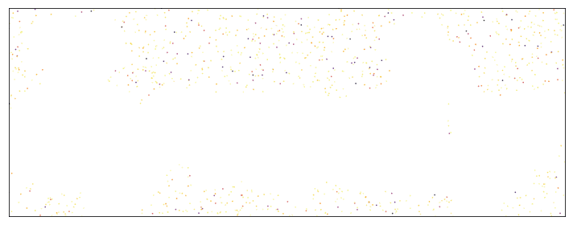

=======
dynesty
=======

``dynesty`` is a Pure Python, MIT-licensed `Dynamic Nested Sampling
<https://arxiv.org/abs/1704.03459>`_ package for estimating Bayesian posteriors
and evidences. See :ref:`Crash Course` and :ref:`Getting Started`
for more information. The latest development version can be found `here
<http://github.com/joshspeagle/dynesty>`_.

**The release paper describing dynesty 1.0 can be found**
`here <https://github.com/joshspeagle/dynesty/tree/master/paper/dynesty.pdf>`__.

As a multi-purpose sampler, ``dynesty`` is designed to perform
"reasonably well" across a large array of problems but is not optimized for
any single one. In particular, please take caution when applying ``dynesty`` to
estimate Bayesian posteriors and evidences for large-dimensional
(>30 dimensions or so) problems.

Installation
============

``dynesty`` is compatible wit Python 3.6+. It requires
``numpy`` (for arithmetic), 
``scipy`` (for special functions), 
``matplotlib`` (for plotting), and 
While not required, ``tqdm`` also allows for a nice progress bar.

Installing the most recent stable version of the package is as easy as::

    pip install dynesty

Alternately, for users who might want newer development versions, it can also
be installed directly from a local copy of the repository by running::

    python setup.py install

Citations
=========

If you find `dynesty` useful in your research, please cite the
`software <https://doi.org/10.5281/zenodo.3348367>`_ and relevant papers.
A list of papers that you
should cite can be generated directly from the `sampler` object by calling::

    print(sampler.citations)

This will return a list of relevant papers and corresponding links to download
citation information such as BibTex files. As an example::

    import dynesty
    sampler = dynesty.DynamicNestedSampler(loglike, prior_transform, ndim,
                                           bound='balls', sample='rwalk')
    print(sampler.citations)

Returns the following list of papers that should be cited::

    Code and Methods:
    ================
    Speagle (2020): https://ui.adsabs.harvard.edu/abs/2020MNRAS.493.3132S
    Koposov et al. (2022): https://doi.org/10.5281/zenodo.3348367

    Nested Sampling:
    ===============
    Skilling (2004): https://ui.adsabs.harvard.edu/abs/2004AIPC..735..395S
    Skilling (2006): https://projecteuclid.org/euclid.ba/1340370944

    Dynamic Nested Sampling:
    =======================
    Higson et al. (2019): https://doi.org/10.1007/s11222-018-9844-0

    Bounding Method:
    ===============
    Buchner (2016): https://ui.adsabs.harvard.edu/abs/2014arXiv1407.5459B
    Buchner (2017): https://ui.adsabs.harvard.edu/abs/2017arXiv170704476B

    Sampling Method:
    ===============
    Skilling (2006): https://projecteuclid.org/euclid.ba/1340370944

If you have utilized some of the error analysis features available through
the provided utility functions (see :ref:`Nested Sampling Errors`),
you should also cite
`Chopin & Robert (2010)
<http://ui.adsabs.harvard.edu/abs/2008arXiv0801.3887C>`_,
`Higson et al. (2018)
<projecteuclid.org/euclid.ba/1508897094>`_,
and `Speagle (2020) <https://ui.adsabs.harvard.edu/abs/2020MNRAS.493.3132S>`_.

See :ref:`References and Acknowledgements` for additional details.

Changelog
=========

2.1.3 (2023-10-04)
------------------
Bug fix release

- Warning is emitted if bootstrap expansion factor is too large ( @segasai )
- Warning is emitted if maxcall/maxiter stop the iterations too early ( @segasai )
- The clustering/K-means for ellipsoid decomposition is now done in scaled space of points divided by stddev along each dimension ( @segasai)
- Update the initialisation of points in the case where some fraction of prior volume has log(L)=-inf this should increase the accuracy of log(Z) estimates in some cases
- Fix a rare possible bug where due to numerical instability in uniform sampling a q==0 error could have occured ( @segasai)
- Fix a FileExistsError when using check-points on Windows ( #450, reported by @rodleiva, fixed by @segasai )

	    
2.1.2  (2023-06-01)
-------------------
Bug fix release

- Fix the restoration of the dynamic sampler from the checkpoint with the pool. Previously after restoring the sampler, the pool was not used. (#438 ; by @segasai)
- Fix the issue with checkpointing from the dynamic sampler. Previously if one batch took shorter than the checkpoint_every seconds then the checkpoints were  not created (by @segasai)
- Fix the restoration from checkpoint that could have occassiounaly lead to one skipped point from nested run (by @segasai)

2.1.1  (2023-04-16)
-------------------
Mostly bug fix release

- Change the way initialization of live-points happens. Now if after 1000 iterations we managed to get at least a single point, the code will continue sampling after putting a warning. Previously the error was raised. (by @segasai )
- Refactor the bound update code which will lead to more consistent boundary updates (#428 by @segasai )
- Fix some pathological cases when uniform distribution is sampled with a very low log likelihood values
- Fix a problem when a very small nlive is used leading to the error (#424 , reported by @frgsimpson)
- Fix the incorrect update_interval calculation leading to too unfrequent updates of bounds when using dynamic sampler (report by @ajw278, analysis and fix by @segasai)
- If you try to resume a previously finished dynamic run, the warning will be raised and the sampler will exit (previously an error could have occured in this case)

2.1.0  (2023-02-03)
-------------------

A release with a major change of the sampler as it is now able to sample likelihood functions with plateaus, (i.e. likelihood  that has the same value across a some non-zero volume).

2.0.3  (2022-12-2)
------------------
A release with major performance bug fix for the dynamical sampler.

- A major performance regression has been discovered that lead to dynamic nested sampling batches becoming slower and slower. The regression was introduced in 1.2 and can easily lead to a factor of several slower performance if a large number of batches is used. (#415 ; discovery and fix by @segasai)
- Some small fixes related to resuming of runs

2.0.2 (2022-11-27)
------------------
Minor bug fix release

- When checkpointing is on the dynamic sampler will always checkpoint in the end of the run_nested() irrespective of checkpoint_time ( by @segasai )
- Equally weighted samples are now randomly shuffled ( #408 ; by @segasai )
- The live_points option was somewhat broken when blob option was introduced requiring a tuple of 4 elements irrespective of whether your likelihood returns blobs or not. Now if you use blob=True and want to provide live_points you need to provide 4 elements (u,v,logl,blobs). If you use blob=False you will need to provide just 3 elements as before (u,v,logl) ( by @segasai)

2.0.1 (2022-10-17)
------------------
Minor bug fix release

- Speed	up sampling when a single thread is used and the logl is fast by avoiding generating generating	random seed sequence (by @segasai)
- Fix the non-working custom samplers (#401 , #402 ; by @ColmTalbot , @segasai)
- Fix the broken resume when using dynesty pool (#403; by @segasai)

2.0.0 (2022-10-06)
------------------
This is a major release with several significant improvements contributed by Sergey Koposov

- The implementation of the check-points to save progress and allow restarting of fits. `See here <https://dynesty.readthedocs.io/en/latest/quickstart.html#checkpointing>`__
- A new simple interface to obtain equally weighted samples directly from results object. `See here <https://dynesty.readthedocs.io/en/latest/crashcourse.html>`__
- Allow likelihood functions to return additional computed quantities (blobs) that will be saved together with samples. `See here <https://dynesty.readthedocs.io/en/latest/quickstart.html#saving-auxialiary-information-from-log-likelihood-function>`__
- Random slice sampling now supports interval doubling scheme which may increase the performance in the case of bad posteriors.

*IMPORTANT* This release includes some major refactoring of class structure in dynesty in to implement the check-pointing. While we haven't seen any breakage in our tests, it is possible that some of more-unusual workflows may be affected. Please submit a bug report on github if you see anything that doesn't look correct. Also, while every effort was made that checkpointing works correctly, it is possible that some corner-cases have been missed. Please report if you see any issues.

All the individual changes are listed below:

- The nested samplers can now be saved and restored from the file using .save() .restore() interface ( #386 ; by @segasai )
- When sampling is performed using run_nested() it is now possible to perform checkpoints at regular intervals, allowing you then resume sampling if it was interrupted ( #386 ; by @segasai )
- The nested sampler results object now allows to retrieve the equal weighted samples directly with results.equal_samples() method as well as allows you to retrieve the importance weights through .importance_weights() method ( #390 ; by @segasai)
- A code for a multiprocessing pool that is specifically adapted for dynesty was added to dynesty.pool. It enables faster performance in the case if the likelihood function takes a long time to pickle or the data/(likelihood arguments) take long time to pickle ( #394 ; by @segasai )
- The likelihood functions can now return auxiliary information (i.e. derived quantities) that will be preserved with the samples. This is done with the blob interface ( #395 ; by @segasai )
- Sampler.n_effective is no longer unnecessarily computed when sampling with an infinite limit on n_effective. ( #379 ; by @edbennett )
- In rare occasions, dynamic nested sampling fits with maxiter set could have failed with 'list index out of range' errors. That was addressed ( #392 ; by @segasai )
- The Monte-Carlo volume calculations by RadFriends/SupFriends/MultiEllipsoid were inaccurate (fix # 398; #399 ; by @segasai )
- Setting n_effective for Sampler.run_nested() and DynamicSampler.sample_initial(), and n_effective_init for DynamicSampler.run_nested(), are deprecated ( #379 ; by @edbennett )
- The slice sampling can now switch to doubling interval expansion algorithm from Neal(2003), if at any point of the sampling the interval was expanded more than 1000 times. It should help slice/rslice sampling of difficult posteriors ( #382 ; by @segasai )
- The accumulation of statistics using to tune proposal distribution is now more robust when multi-threading/pool is used. Previously statistics from every queue_size call were used and all other were discarded. Now the statistics are accumulated from all the parallel sampling calls. That should help sampling of complex distributions. ( #385 ; by @segasai ) 
- The .update_proposal() function that updates the states of samplers now has an additional keyword which allows to either just accumulate the statistics from repeated function calls or actual update of the proposal. This was needed to not loose information when queue_size>1 ( #385 ; by @segasai )
- The ellipsoid bounding has been sped up by not using the Cholesky transform , also a check was added/test expanded for possible numerical issues when sampling from multiple ellipsoids potentially causing assert q>0 ( #397 ; by @segasai )
- The individual samplers now take as input a special Namedtuple SamplerArgument rather than just a tuple ( #400 ; by @segasai ).

	    
1.2.3 (2022-06-02)
------------------
Bug fix release

- Add a copy() method to Results object
- Prevent an issue when pickling/unpickling samplers
- Small ellipsoidal sampling speed-up

1.2.2 (2022-04-12)
------------------
Bug fix release

- The problem with biased posteriors was fixed when using multi-ellipsoid
  bounds and rslice and rwalk samplers. Previously the chains did not satisfy
  detailed balance. (issue #364). Original discovery of the problem
  and help by Colm Talbot. In the case of complex posteriors, somewhat slower
  performance may be seen.
- Fix the issue introduced in 1.2.1 when the prior_transform returns a tuple or
  or a list (rather than numpy array). Now that should be accepted.

1.2.1 (2022-04-04)
------------------
Small bug fix release

- The arguments of prior_transform and likelihood function are now explicitly copied, so the sampling can work if those function apply changes to argument vectors ( #362 )
- Fix the compilation of the docs, and update them a bit

1.2.0 (2022-03-31)
------------------

This version has multiple changes that should improve stability and speed. The default dynamic sampling behaviour has been changed to focus on the effective number of posterior samples as opposed to KL divergence. The rstagger sampler has been removed and the default choice of the sampler may be different compared to previous releases depending on the dimensionality of the problem. dynesty should now provide 100% reproduceable results if the rstate object is provided. It needs to be a new generation Random Generator (as opposed to numpy.RandomState)

Most of the changes in the release have been contributed by [Sergey Koposov](https://github.com/segasai) who has joined the dynesty project.

- Saving likelihood. It is now possible to save likelihood calls history during sampling into HDF5 file (this is not compatible with parallel sampling yet). The relevant options are  save_history=False, history_filename=None (#235)
- add_batch() function now has the mode parameter that allows you to manually chose the logl range for the batch (#328)
- More testing with code coverage of >90% + validation on test problems
- Internal refactoring reducing code duplication (saved_run, integral calculations, different samplers etc)
- Multiple speed-ups: ellipsoid bounds, bootstrap, jitter_run (#239, #256, #329)
- Exception is raised if unknown arguments are provided for static/dynamic samplers (#295)

- Migrate to new numpy random generator functionality from RandomState (#280)
- Make dynesty fully deterministic if random state is provided (#292)

- Remove the pointvol parameter used in internal calculations, such as ellipsoid splits (#284)
- Get rid of vol_dec parameter (#286)
- Improve bounding ellipsoids algorithms, for example how we are dealing with degenerate ellipsoids (#264, #268)
- Introduce more stable multi-ellipsoidal splitting using BIC (#286)

- Do not use KL divergence function for stopping criteria based on posterior, instead use the criterion based on the number of effective samples. The old behaviour can still be achieved by using the dynesty.utils.old_stopping_function (#332)
- Fix bugs in dynamic sampling that can lead to sampler not finding points in the interval (#244)
- Major refactor of rslice/slice sampling increasing its stability (#269, #271)
- Disable ncdim when slice sampling (#271)
- Change the defaults for slices/walks/bootstrap (vs number of dimensions) (#297)
- Change default samplers (vs ndim, i.e. use rslice for high dimensions) (#286)
- Remove rstagger sampler, as it was producing incorrect results/based on non-Markovian chains (#322)
- Fix rwalk sampler. Previously the chains were not Markovian (#319, #323, #324)
- Change step adaptation of rwalk and rslice (#260, #323)
- Change the calculation of evidence uncertainties, remove factor the unnecessary factor two, and improve numerical stability of calculations (#306, #360)
- Refactor the addition of batches in dynamic sampling, preventing possibly infinite loop (#326)
- Improve stability of resample_equal (#351)
- New Results interface with a dedicated object, rather than a wrapper around the dictionary (#330)
 

1.1 (2021-04-05)
------------------
- Improved behavior and stability of the bounding distributions (with
  `Sergey Koposov <https://github.com/segasai>`_ and
  `Johannes Buchner <https://github.com/johannesbuchner>`_).

- Added support for specifying the number of clustering dimensions (`'ncdim'`)
  in case these may differ from the number of prior dimensions (`'npdim'`)
  (with `Colm Talbot <https://github.com/ColmTalbot>`_).

- Fixed a bug where ``dynesty`` was not properly enforcing nested sampling's
  monotonically-increasing likelihood condition when sampling
  (with `Colm Talbot <https://github.com/ColmTalbot>`_).

- Improved ability to save sampler objects to disk to backup progress (with
  `Patrick Sheehan <https://github.com/psheehan>`_ and
  `Alex Nitz <https://github.com/ahnitz>`_).

- Limited support for user-defined proposal strategies (with
  `Gregory Ashton <https://github.com/GregoryAshton>`_).

- Additional small bugfixes, references, and documentation updates.

1.0.1 (2020-01-17)
-------------------
* Small quality-of-life improvements to plotting.

* Added citation tool.

1.0.0 (2019-09-22)
-------------------
* Added support for period and reflective boundaries (with
  `Gregory Ashton <https://github.com/GregoryAshton>`_).

* Added support for interactive progress bar (with
  `Daniel Foreman-Mackey <https://github.com/dfm>`_).

* Added support for stopping criterion based on ESS (with
  `Colm Talbot <https://github.com/ColmTalbot>`_).

* Small bugfixes to code and documentation.

* Small quality-of-life improvements.

0.9.7 (2019-06-13)
-------------------
* Ensemble bounds can now adapt to elongated distributions (with
  `Johannes Buchner <https://github.com/JohannesBuchner>`__).

* Random walks now behave differently near boundaries (with
  `Gregory Ashton <https://github.com/GregoryAshton>`_).

* Pickling sampler states should now work better in Python 3 (with
  `Dustin Lang <https://github.com/dstndstnr>`_.

* Doubled output errors in default approximation in line with theoretical
  expectations.

* Small bugfixes and docfixes (with
  `Patricio Cubillos <https://github.com/dstndstnr>`_).

0.9.5.3 (2019-03-29)
--------------------
* Various small bugfixes, with contributions by
  `Gregory Ashton <https://github.com/GregoryAshton>`_ and
  `Johannes Buchner <https://github.com/JohannesBuchner>`__.

0.9.5 (2019-03-14)
-------------------
* Added support for periodic boundary conditions.

* Set up basic tests for continuous integration.

0.9.4 (2019-03-07)
-------------------
* Added a logo!

* Updated and reorganized documentation and demos.

* Added proper support for gradients.

* Changed defaults and added several "quality of life" improvements.

0.9.3 (2019-02-10)
-------------------
* Updated documentation.

* Modified re-scaling behavior to better deal with inefficient proposals.

* Improved stability of the current ellipsoid decomposition algorithm.

* Added new `'auto'` options and changed a number of defaults to make things
  easier for general users.

* Plotting now defaults to 95% credible intervals instead of 68%.

0.9.2 (2018-03-17)
------------------

* Added in a fast approximation option for `jitter_run` and `simulate_run`.

* Modified the default stopping heuristic. It now evaluates significantly
  faster but is a less accurate probe of the "true" KL divergence.

* Modified `'rwalk'` behavior to better deal with edge cases.

* Changed defaults so performance should now be more stable (albeit slower) 
  for the average user.

* Improved the stability of bounding ellipsoids.

* Fixed performance issues with `'rslice'` and `'hslice'`.

* Small plotting improvements.

0.9.1 (2018-03-01)
------------------

* Fixed a minor bootstrapping bug that affected performance for some users.

* Fixed a serious bug associated with the new singular decomposition algorithm
  and changed its behavior so it no longer auto-kills user runs when it fails.

0.9.0 (2018-02-25)
------------------

* `dynesty` is now on PyPI!

0.8.4 (2018-02-24)
------------------

* Added two new slice sampling options (`'rslice'` and `'hslice'`).

* Changed internals to allow user to access quantities during dynamic batch
  allocation. **WARNING: Breaks some aspects of backwards compatibility
  for advanced users utilizing generators.**

* Simplified parallelism options.

* Fixed a singular decomposition bug that occasionally appeared during runtime.

* Small plotting/utility improvements.

0.8.3 (2017-12-13)
------------------

* Fixed additional Python 2/3 compatibility bugs.

* Added the ability to pass user-specified custom print functions.

* Added importance reweighting.

* Small improvements to plotting utilities.

* Small changes to improve user outputs and basic functionality.

0.8.2 (2017-09-15)
------------------

* Fixed `map` bugs that broke compatibility between Python 2 and 3.

* Fixed a bug where the sampler could break during the first update from the
  unit cube when using a `pool`.

0.8.1 (2017-09-12)
------------------

* Introduced a function wrapper for `prior_transform` and `loglikelihood`
  functions to allow users to pass `args` and `kwargs`.

* Fixed a small bug that could cause bounding ellipsoids to fail.

* Introduced a stability fix to the default 
  `~dynesty.dynamicsampler.weight_function` when computing evidence-based
  weights.

0.8.0 (2017-09-08)
------------------

Initial beta release.

.. toctree::
   :hidden:
   :maxdepth: 3

   crashcourse
   overview
   quickstart
   dynamic
   errors
   examples
   faq
   references
   api
