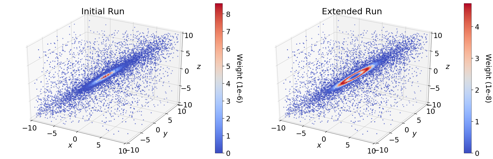
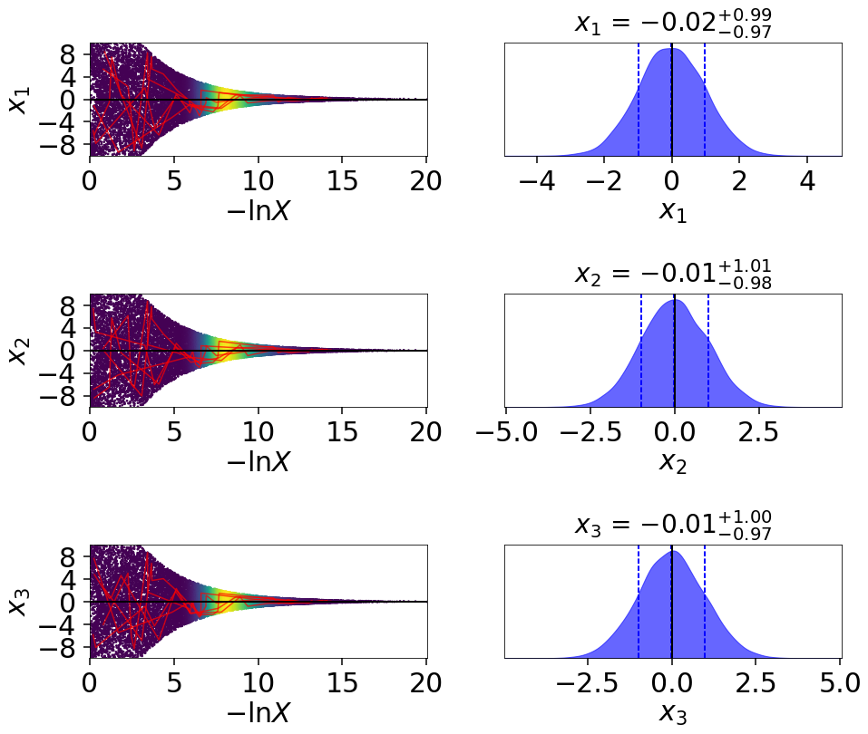
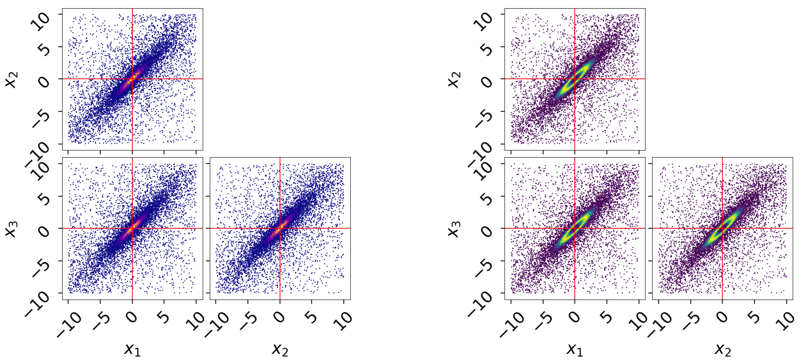
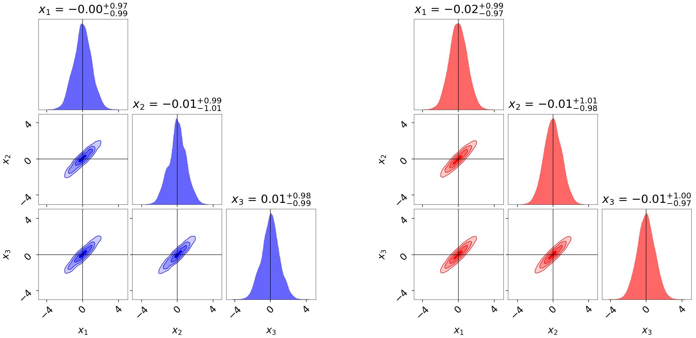
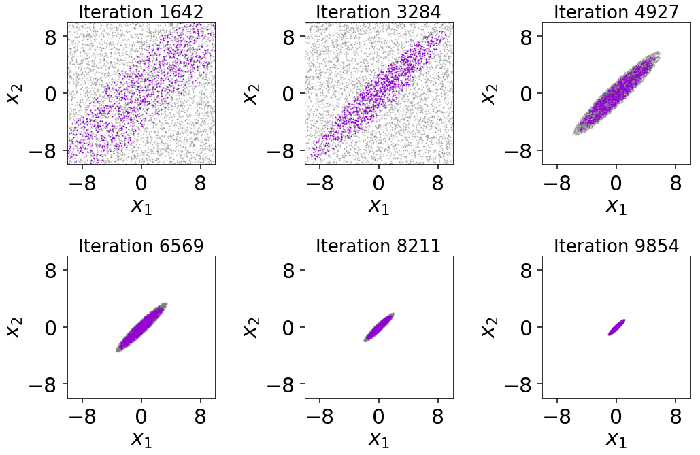
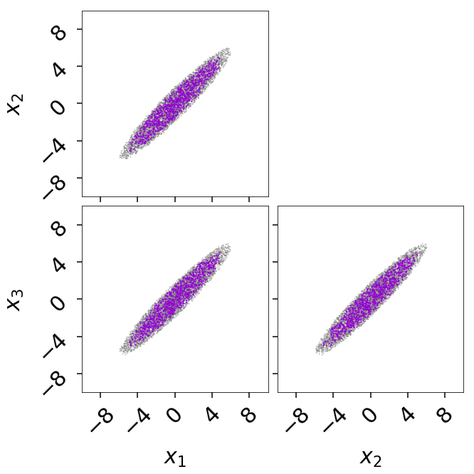

===============
Getting Started
===============

Prior Transforms
================

The **prior transform** function is used to implicitly specify the Bayesian
prior :math:`\pi(\boldsymbol{\Theta})` for Nested Sampling. It functions as
a transformation from a space where variables are i.i.d. within the
:math:`D`-dimensional unit cube (i.e. uniformly distributed from 0 to 1)
to the parameter space of interest. For independent
parameters, this would be the product of the `inverse cumulative distribution
function (CDF) <https://en.wikipedia.org/wiki/Quantile_function>`_ (also
known as the "percent point function" or "quantile function") associated with
each parameter.

It is crucial to note that increasing the size of the prior *directly*
impacts the amount of time needed to integrate over the posterior.
We highlight some examples of prior transforms below.

Example: Uniform Priors
-----------------------

Suppose we want our prior to be Uniform from [-10, 10) for all variables:

.. math::

   p(x) \propto \left\{
                \begin{array}{ll}
                  1 \quad -10 \le x < 10\\
                  0 \quad {\rm otherwise}
                \end{array}
              \right.

The prior transform for this distribution would be::

    def prior_transform(u):
        """Transforms the uniform random variable `u ~ Unif[0., 1.)`
        to the parameter of interest `x ~ Unif[-10., 10.)`."""

        x = 2. * u - 1.  # scale and shift to [-1., 1.)
        x *= 10.  # scale to [-10., 10.)

        return x

Example: Non-uniform priors
---------------------------

Suppose we instead have a more complicated prior in 5 variables.
The first 2 are drawn from a 
`bivariate Normal <https://en.wikipedia.org/wiki/MVN>`_ distribution, 
the third is drawn from a 
`Beta <https://en.wikipedia.org/wiki/Beta_distribution>`_ distribution,
the fourth from a
`Gamma <https://en.wikipedia.org/wiki/Gamma_distribution>`_ distribution,
and the fifth from a truncated normal distribution.
To handle more complicated functions like these, we can use the built-in
`functions <https://docs.scipy.org/doc/scipy/reference/stats.html>`_
in `scipy.stats`, which include a **percent point function (ppf)** that
is analogous to our prior transform. Using those, our above examples
would look like::

    def prior_transform(u):
        """Transforms the uniform random variables `u ~ Unif[0., 1.)`
        to the parameters of interest."""

        x = np.array(u)  # copy u

        # Bivariate Normal
        t = scipy.stats.norm.ppf(u[0:2])  # convert to standard normal
        Csqrt = np.array([[2., 1.],
                          [1., 2.]])  # C^1/2 for C=((5, 4), (4, 5))
        x[0:2] = np.dot(Csqrt, t)  # correlate with appropriate covariance
        mu = np.array([5., 2.])  # mean
        x[0:2] += mu  # add mean

        # Beta
        a, b = 2.31, 0.627  # shape parameters
        x[2] = scipy.stats.beta.ppf(u[2], a, b)

        # Gamma
        alpha = 5.  # shape parameter
        x[3] = scipy.stats.gamma.ppf(u[3], alpha)

        # Truncated Normal
        m, s = 5, 2  # mean and standard deviation
        low, high = 2., 10.  # lower and upper bounds
        low_n, high_n = (low - m) / s, (high - m) / s  # standardize
        x[4] = scipy.stats.truncnorm.ppf(u[4], low_n, high_n, loc=m, scale=s)

        return x

Example: Conditional priors
---------------------------

This procedure can be generalized to construct priors that only can be
expressed in conditional form. As an example, let's assume we have
a three-parameter model where the prior for the third parameter depends
on the values for the first two. This might be the case in, e.g., a
`hierarchical <https://en.wikipedia.org/wiki/Bayesian_hierarchical_modeling>`_
model where the prior over `c` is a Normal distribution whose mean 
`m` and standard deviation `s` are determined by a corresponding
"hyper-prior". We can easily set up a prior transform for this model 
by just going through the variables in order. This would look like::

    def prior_transform(u):
        """Transforms the uniform random variables `u ~ Unif[0., 1.)`
        to the parameters of interest."""

        x = np.array(u)  # copy u

        # Mean hyper-prior
        mu, sigma = 5., 1.  # mean, standard deviation
        x[0] = scipy.stats.norm.ppf(u[0], loc=mu, scale=sigma)

        # Standard deviation hyper-prior
        x[1] = 10. ** (u[1] * 2. - 1.)  # log10(std) ~ Uniform[-1, 1]

        # Prior
        x[2] = scipy.stats.norm.ppf(u[2], loc=x[0], scale=x[1])

        return x

More complicated dependencies can be constructed using similar approaches.

Nested Sampling with dynesty
============================

To give a concrete example of running ``dynesty`` on a real problem,
let's return to the simple 3-D multivariate normal
likelihood and uniform prior from [-10, 10) used in :ref:`Crash Course` to
define the :meth:`loglikelihood` and :meth:`prior_transform` functions::

    import numpy as np

    # Define the dimensionality of our problem.
    ndim = 3

    # Define our 3-D correlated multivariate normal log-likelihood.
    C = np.identity(ndim)
    C[C==0] = 0.95
    Cinv = linalg.inv(C)
    lnorm = -0.5 * (np.log(2 * np.pi) * ndim +
                    np.log(np.linalg.det(C)))

    def loglike(x):
        return -0.5 * np.dot(x, np.dot(Cinv, x)) + lnorm

    # Define our uniform prior via the prior transform.
    def ptform(u):
        return 20. * u - 10.

Initialization
--------------

Nested Sampling in `dynesty` is done via a particular `sampler`
object that is initialized from the :ref:`Top-Level Interface`. To start,
let's use :meth:`~dynesty.dynesty.NestedSampler` to initialize a particular
sampler from `~dynesty.nestedsamplers`. There are only 3 required arguments: 
a log-likelihood function (`loglike`), a prior transform function (`ptform`),
and the number of dimensions taken by the loglikelihood (`ndim`). 

Using the functions above, we can initialize our sampler using::

    from dynesty import NestedSampler

    # initialize our nested sampler
    sampler = NestedSampler(loglike, ptform, ndim)

See :ref:`Top-Level Interface` for more details on the API, :ref:`Examples` 
for more examples of usage, and :ref:`FAQ` for
some additional advice. Here we'll go over just the basics.

Live Points
-----------

Similar to ensemble sampling methods such as 
`emcee <http://dan.iel.fm/emcee/current/>`_, the behavior of Nested Sampling
can also be sensitive to the number of live points used. Increasing the number
of live points leads to smaller changes in the prior volume :math:`\ln X` over
time. This improves the effective resolution while simultaneously increasing
the runtime.

In addition, the number of live points can also affect the stability of our
:ref:`Bounding Options`. By default, ``dynesty`` inflates the size of the
chosen bounds by an enlargement factor to ensure they effectively bound the
iso-likelihood contours. These bounds become more robust the more live points
are used, leading to more efficient proposals.

It is important to note that running with too few live points can lead to
mode "die off". When there are multiple modes with live points distributed
between them, live points can randomly "jump" between them at any given
iteration. If there are only a handful of live points at a particular mode,
it is possible that, entirely by chance, all of them could transfer
completely to the other mode even as both remain equally likely,
leading it to "die off" and likely never be located again. As a rule-of-thumb,
you should allocate around 50 live points per possible mode to guard against
this.

The number of live points can be specified upon initialization via the 
`nlive` argument. For example, if we want to run with 1000 live points rather
than the default 250, we would use::

    NestedSampler(loglike, ptform, ndim, nlive=1500)

Bounding Options
----------------

``dynesty`` supports a number of options for bounding the target distribution:

* **no bound** (`'none'`), i.e. sampling from the entire unit cube,

* a **single bounding ellipsoid** (`'single'`),

* **multiple** (possibly overlapping) **bounding ellipsoids** (`'multi'`),

* **overlapping balls** centered on each live point (`'balls'`), and

* **overlapping cubes** centered on each live point (`'cubes'`).

By default, ``dynesty`` uses multi-ellipsoidal decomposition (`'multi'`),
which often is flexible enough to capture the complexity of many likelihood
distributions while simple enough to quickly and efficiently generate new
samples. For more complex distributions, overlapping balls (`'balls'`)
or cubes (`'cubes'`) can generate more flexible bounding distributions but
come with significantly more overhead that can be less efficient at generating
samples. For simpler distributions, a single ellipsoid (`'single'`) is often
sufficient. Sampling directly from the unit cube (`'none'`) is extremely
inefficient but is a useful option to verify your results and
look for possible biases. It otherwise should only be used if the
log-likelihood is trivial to compute.

Specifying the particular bounding distribution can be done upon initialization
via the `bound` argument. If we wanted to sample using overlapping balls rather
than multiple bounding ellipsoids, for instance, we would use::

    NestedSampler(loglike, ptform, ndim, nlive=1500, bound='balls')

As mentioned in :ref:`Live Points`, bounding distributions in ``dynesty`` are
enlarged in an attempt to conservatively encompass the iso-likelihood contour
associated with each dead point. The default behavior increases the
volume by 25%, although this can also be done in real-time using
bootstrapping methods (this procedure can lead to some instability in the size
of the bounds if fewer than the optimal number of live points are being used;
see the :ref:`FAQ` for additional details). 
The volume enlargement factor or the number of 
bootstrap realizations used can be specified using the `enlarge` 
and `bootstrap` arguments. 

Additional information on the bounding objects can be found under
:ref:`Bounding` and in :ref:`Examples`.

To avoid excessive overhead spent constructing bounding
distributions, ``dynesty`` only updates bounding distributions after a fixed
number of likelihood calls specified by the `update_interval` argument. Larger
values generally decrease the sampling efficiency but can improve overall
performance. This value by default is set to different values for different
sampling methods (see the :ref:`API` for additional details), but if
we wanted to instead use a particular value we could just specify that via::

    NestedSampler(loglike, ptform, ndim, nlive=1500, bound='balls',
                  bootstrap=50, update_interval=1.2)

Passing a float like `1.2` sets the update interval to be after 
`round(1.2 * nlive)` functional calls so that it scales based on the
number of live points (and thus the speed at which we expect to traverse
the prior volume). If we'd like to specific the number of function calls
directly, however, we can instead pass an integer::

    NestedSampler(loglike, ptform, ndim, nlive=1500, bound='balls',
                  bootstrap=50, update_interval=600)

This now specifies that we will update our bounds after `600` function
calls.

See :ref:`Top-Level Interface` for more information.

Sampling Options
----------------

`dynesty` also supports several different sampling methods *conditioned on*
the provided bounds which can be passed via the `sample` argument:

* **uniform** sampling (`'unif'`),

* **random walks** away from a current live point (`'rwalk'`),

* **multivariate slice sampling** away from a current live point (`'slice'`),

* **random slice sampling** away from a current live point (`'rslice'`), and

* **"Hamiltonian" slice sampling** away from a current live point (`'hslice'`).

In addition, `dynesty` also supports passing **custom callable functions**
to the `sample` argument, provided they follow the same format as the
default sampling functions defined `here
<https://github.com/joshspeagle/dynesty/blob/master/dynesty/sampling.py>`__.
These can also be accompanied by custom "update functions" that try to
adaptively scale proposals to ensure better overall sampling efficiency.
See `here
<https://github.com/joshspeagle/dynesty/blob/master/dynesty/nestedsamplers.py>`__
for examples of some of the functions that are associated with the default
sampling methods described above.

By default, `dynesty` automatically picks a sampling method
based on the dimensionality of the problem via the `'auto'` argument, which
uses the following logic:

* If :math:`D < 10`, `'unif'` is chosen since uniform proposals can
  be quite efficient in low dimensions.

* If :math:`10 \leq D \geq 20`, `'rwalk'` is chosen
  since random walks are more robust to underestimated bounding
  distributions in higher dimensions,

* If :math:`D > 20` and a gradient is not provided,
  `'rslice'` is chosen since non-rejection sampling
  methods scale in polynomial (rather than exponential) time as the
  dimensionality increases.

* If :math:`D > 20` and a gradient *is* provided, `'hslice'` is chosen
  to take advantage of Hamiltonian dynamics, which scale better than `'rslice'`
  as the dimensionality increases.

Note that `'hslice'`, while using gradients, is substantially less efficient
(and in general less reliable) than other gradient-based approaches such
as Hamiltonian Monte Carlo. As such, **use them at your own risk.**

One benefit to using random walks or slice sampling is that they require many
fewer live points to adapt to structure in higher dimensions (since they only
sample *conditioned* on the bounds, rather than **within** them). 
They also do not require any sort of bootstrap-style corrections 
since they contain built-in methods to tune their step sizes. This, however,
does not mean that they are immune to issues that arise when running with
fewer live points such as mode "die-off" (see :ref:`Live Points`).

Following the example above, let's say we wanted to combine the flexibility of
multiple bounding ellipsoids and slice sampling.
This might look something like:: 

    NestedSampler(loglike, ptform, ndim, bound='multi', sample='slice')

See :ref:`Top-Level Interface` for additional information.

Early-Time Behavior
-------------------

``dynesty`` tries to avoid constructing bounding distributions
early in the run to avoid issues where the bounds can significantly exceed the
unit cube. For instance, in most cases the bounding distribution 
of the initial set of points *by construction* will exceed
the bounds of the unit cube when `enlarge > 1`. This can lead to a 
variety of problems associated with each method, especially in higher
dimensions (since volume scales as :math:`\propto r^D`).

To avoid this behavior, ``dynesty`` deliberately delays the first bounding
update until at least `2 * nlive` function calls have been made *and* the
efficiency has fallen to 10%. This generally assumes that the overall
efficiency will be below 10%, which is the case for almost all sampling
methods (see below). If we wanted to adjust this behavior so
that we construct our first bounding distributions much earlier,
we could do so by passing some parameters using the `first_update`
argument::

    NestedSampler(loglike, ptform, ndim, nlive=1500, bound='balls',
                  first_update={'min_ncall': 100, 'min_eff': 50.})

This will now trigger an update when 100 log-likelihood function calls have
been made and the efficiency drops below 50%.

Special Boundary Conditions
---------------------------

By default, ``dynesty`` assumes that all parameters have hard bounds.
In other words, if for some reason you propose outside of the unit cube
that defines the prior (see :ref:`Prior Transforms`), that point is
automatically rejected and a new one is proposed instead. This is
the desired behavior for most problems, since individual parameters are often
either defined everywhere (i.e. from negative infinity to infinity)
or over a finite range (e.g., from :math:`10` to :math:`25`).

Specific problems, however, may have parameters that behave differently.
In particular, ``dynesty`` supports both **reflective** and **periodic**
boundary conditions. The former can arise when parameters are ratios (where
:math:`1/2` and :math:`2/1` may be equivalent) or angles (since 90 degrees and
450 degrees are often equivalent). Imposing these specific boundary conditions
on relevant parameters can help improve the overall sampling efficiency,
especially when solutions end up near the bounds (e.g., at :math:`0` or
:math:`2\pi` for phases). These can be enabled by just
specifying the indices of the relevant parameters, as shown below::

    NestedSampler(loglike, ptform, ndim, nlive=1000, bound='cubes',
                  periodic=[0, 2], reflective=[1, 5])

Parallelization
---------------

If you want to run computations in parallel, `dynesty` can use a user-defined
`pool` to execute a variety of internal operations in "parallel" rather than
in serial. This can be done by passing the `pool` object to the sampler
upon initialization::

    # initialize sampler with pool
    sampler = NestedSampler(loglike, ptform, ndim, pool=pool)

By default, `dynesty` tries to grab the size of the pool from the `pool.size`
attribute of the `pool`. If this is not defined, the number of function
evaluations to execute in parallel can be set manually using the `queue_size`
argument::

    # initialize sampler with pool with pre-defined queue
    sampler = NestedSampler(loglike, ptform, ndim, pool=pool, queue_size=8)

There is *no* reason to set queue_size to anything other then the number of parallel processes in the pool.

Parallel operations in `dynesty` are done by simply swapping in the
`pool.map` function over the default `map` function when making likelihood
calls. Note that this is a *synchronous* function call, which requires that
all members of the pool have completed their respective tasks before receiving
the pool's output. The call time for functions is therefore limited
by the slowest-performing member of the pool.

The reason why "parallel" is written in quotes above is that while function
evaluations can be made in parallel, live point proposals must be done serially
in order to avoid breaking the statistical properties of Nested Sampling.
Assuming we are using :math:`M` processes with :math:`K` live points, this
leads to sub-linear speed improvements :math:`S` of the form
(`Handley et al. 2015 <https://arxiv.org/pdf/1506.00171.pdf>`_):

.. math::

    S(M, K) = K \ln \left(1 + \frac{M}{K}\right)

This scales pretty linearly with the number of processes till the number of parallel processes is equal or larger than the number of live-points.

Depending on where the bottleneck of the computation lies, the provided
`pool` can be disabled during certain function evaluations (e.g., when
initializing points) using the `use_pool` argument::

    # initialize sampler with pool with pre-defined queue
    sampler = NestedSampler(loglike, ptform, ndim,
                            nlive=2000, bound='single', sample='rwalk',
                            pool=pool, queue_size=16,
                            use_pool={'prior_transform': False})

See :ref:`Pool/Parallelization Questions` on the :ref:`FAQ` page for additional troubleshooting
tips.

Note that, as discussed in :ref:`Combining Runs`, it is actually possible to
combine multiple independent Nested Sampling runs into a single run, giving
users an option as to whether they want to parallelize `dynesty` *during*
runtime (using a user-provided `pool`) or *after* runtime (by merging
the runs together).

Dynesty multiprocessing pool
----------------------------

If you are running multiprocessing on a single machine, probably the easiest way
of parallelizing is using a dynesty provided pool (which is a thin wrapper around
python's multiprocessing pool)::

    with Pool(10, loglike, ptform) as pool:
        sampler = NestedSampler(pool.loglikehood, pool.prior_transform,
	                        ndim, pool = pool)
	sampler.run_nested()

Note that we provide the likelihood function and prior transforms
when we initialize the pool. When we run dynesty we provide the
loglikelihood and prior transforms from the pool. This approach minimizes
the overhead from picking function repeatedly.

If your function has additional arguments that are large, you can also provide
them when initializing the pool::

    with Pool(10, loglike, ptform, logl_args=loglike_args) as pool:
        sampler = NestedSampler(pool.loglikehood, pool.prior_transform,
	                        ndim, pool = pool)
	sampler.run_nested()

Running Internally
------------------

Sampling from our target distribution can be done using the
:meth:`~dynesty.sampler.Sampler.run_nested` function in the provided
`sampler`:: 

    sampler.run_nested()

Sampling will continue until specified stopping criteria are reached, and
the current state of the sampler is by default output to `~sys.stderr` in
real time. The stopping criteria can be any combination of:

* a fixed number of iterations (`maxiter`),

* a fixed number of likelihood calls (`maxcall`),

* a maximum log-likelihood `(logl_max`),

* a specified :math:`\Delta \ln \hat{\mathcal{Z}}_i` tolerance (`dlogz`), and

* a specified Effective Sample Size
  (`ESS <https://en.wikipedia.org/wiki/Effective_sample_size>`_) (`n_effective`).

For instance, running one of the examples above would produce output like:

.. rst-class:: sphx-glr-script-out

Out::

    iter: 12521 | +1500 | bound: 7 | nc: 1 | ncall: 66884 | eff(%): 20.963 |
    loglstar:   -inf < -0.301 <    inf | logz: -8.960 +/-  0.082 |
    dlogz:  0.001 >  1.509                                        

From left to right, this records: the current iteration (plus the number of
live points added after stopping), the current bound being used, the number
of log-likelihood calls made before accepting the last sample, the total number
of log-likelihood calls, the overall sampling efficiency, 
the current log-likelihood bounds (`-inf` and `inf`
because we began sampling from the prior and didn't declare a `logl_max`),
the current estimated evidence, and the remaining `dlogz` relative
to the stopping criterion.

By default, the stopping criteria are optimized for evidence estimation, with
posteriors treated as a nice byproduct. We can modify this
by passing in something like::

    sampler.run_nested(dlogz=0.5, maxiter=10000, maxcall=50000)

Since sampling is done through the `sampler` objects, users can also continue
to add new samples based on where they left off. This is as easy as::

    # initialize our sampler
    sampler = NestedSampler(loglike, ptform, ndim, nlive=1000)

    # start our run
    sampler.run_nested(dlogz=0.5)
    res1 = sampler.results

    # (possibly) add more samples
    sampler.run_nested(maxcall=10000)
    res2 = sampler.results

    # (possibly) add more samples again
    sampler.run_nested(dlogz=0.01)
    res3 = sampler.results

Checkpointing
--------------

While running the sampler using run_nested() interface it is possible to check-point (or save) the state of the sampler into a file at regular intervals. This file can then be used to restart/resume the sampling::

    # initialize our sampler
    sampler = NestedSampler(loglike, ptform, ndim, nlive=1000)
    # run the sampler with checkpointing 
    sampler.run_nested(checkpoint_file='dynesty.save')  

You can then restore it now and resume sampling::

    # restore our sampler
    sampler = NestedSampler.restore('dynesty.save')
    # resume
    sampler.run_nested(resume=True)  

If you used the pool in the sampler and you want to use the pool after restoring, you need to specify it when restoring::

    mypool = multiprocessing.Pool(6)
    # restore the sampler
    sampler = NestedSampler.restore('dynesty.save', pool =mypool)
    # resume
    sampler.run_nested(resume=True)

The checkpointing may be helpful if you are running dynesty on HPC with a queue system that has a limit on a wall-time that your jobs can run.
There is a however an important reminder that should *NOT* use checkpointing for persistence. I.e. if you want to save the results of the sampling, you should save samples, weights or the results object, rather than the whole nested sampling object (as checkpointing does). The reason for this is that the checkpoint files are not guaranteed to be compatible between dynesty versions (even minor ones).

Saving auxiliary information from log-likelihood function
----------------------------------------------------------

Occasionally it is useful to save the information computed by the likelihood function, such as various derived quantities. This information can be easily saved by dynesty together with the samples. To do that you need to use the blob option of NestedSampler and DynamicNestedSampler::

    def loglike(x):
        logl = -0.5 * np.sum(x**2)
	blob = np.zeros(3)
	blob[0] = x[0]
	blob[1] = x[1]**2
	blob[2] = logl+x[2]
	# here the logl function return the logl and a numpy array
	return logl, blob
    # initialize our sampler
    sampler = NestedSampler(loglike, ptform, ndim, nlive=100, blob=True)
    # run the sampler with checkpointing 
    sampler.run_nested()
    results = sampler.results
    aux_blob = results['blob']
    # This variable will contain auxiliary blobs associated with samples

The numpy blob can return arbitrary 1D numpy arrays. The can be record arrays as well. The only requirement is that the shape/dtype is exactly the same between the log-likelihood function calls.

Running Externally
------------------

Similar to `emcee <http://dan.iel.fm/emcee/current/>`_, `sampler` objects in
``dynesty`` can also be run externally as a **generator** via the
:meth:`~dynesty.sampler.Sampler.sample` function. This might look something
like::

    # The main nested sampling loop.
    for it, res in enumerate(sampler.sample(dlogz=0.5)):
        pass

    # Adding the final set of live points.
    for it_final, res in enumerate(sampler.add_live_points()):
        pass

as opposed to::

    # The main nested sampling loop.
    sampler.run_nested(dlogz=0.5, add_live=False)

    # Adding the final set of live points.
    sampler.add_final_live()

This can be extremely useful if you would like to manipulate the results
in real-time, generate plots, save intermediate outputs, etc.

Combining Runs
--------------

Nested sampling is "trivially parallelizable", which makes it really
straightforward to combine the results from multiple independent runs.
``dynesty`` contains built-in utilities for combining results
from separate runs into a single run with improved posterior/evidence
estimates. This can be extremely useful if, for instance, you have performed
multiple independent analyses over the course of a project that you would
like to combine, or if you want to add additional samples to a
preliminary analysis (but don't have the `sampler` currently loaded in memory).

``dynesty`` makes this process relatively straightforward. An example is
shown below::

    from dynesty import utils as dyfunc

    # Create several independent nested sampling runs.
    sampler = NestedSampler(loglike, ptform, ndim)
    rlist = []
    for i in range(10):
        sampler.run_nested()
        rlist.append(sampler.results)
        sampler.reset()

    # Merge into a single run.
    results = dyfunc.merge_runs(rlist)

This process works with :ref:`Dynamic Nested Sampling` as well. See
:ref:`Unraveling/Merging Runs` for additional details.

Sampling with Gradients
-----------------------

As mentioned in :ref:`Sampling Options`,
``dynesty`` can utilize log-likelihood gradients :math:`\nabla \ln \mathcal{L}`
by proposing new samples using Hamiltonian dynamics
(often referred to as **reflective slice sampling**). However, because
sampling in ``dynesty`` occurs on the *unit cube* (:math:`\mathbf{u}`) rather
than in the target space of our original variables (:math:`\mathbf{x}`),
these gradients have to be defined with respect to :math:`\mathbf{u}` rather
than :math:`\mathbf{x}` even though they are evaluated at :math:`\mathbf{x}`.
This requires computing the Jacobian matrix
:math:`\mathbf{J}` from :math:`\mathbf{x}` to :math:`\mathbf{u}`.

While this Jacobian might seem difficult to derive, it can be shown that
given independent priors on each parameter

.. math::

    \pi(\mathbf{x}) = \prod_i \pi_i(x_i)

where :math:`\pi_i(x_i)` is the prior for the i-th parameter :math:`x_i`
that the Jacobian is diagonal where each diagonal element is simply

.. math::

    J_ii = 1 / \pi_i(x_i)

By default, ``dynesty`` assumes that any gradient you pass in
**already has the appropriate Jacobian applied**. If not, you can tell
``dynesty`` to numerically estimate the Jacobian by setting
`compute_jac=True`.

For the simple 3-D multivariate normal likelihood and uniform prior
from [-10, 10) used in :ref:`Crash Course`, sampling with gradients
would look something like::

    import numpy as np
    import dynesty

    # Define the dimensionality of our problem.
    ndim = 3

    # Define our 3-D correlated multivariate normal log-likelihood.
    C = np.identity(ndim)
    C[C==0] = 0.95
    Cinv = linalg.inv(C)
    lnorm = -0.5 * (np.log(2 * np.pi) * ndim +
                    np.log(np.linalg.det(C)))

    def loglike(x):
        return -0.5 * np.dot(x, np.dot(Cinv, x)) + lnorm

    # Define our uniform prior via the prior transform.
    def ptform(u):
        return 20. * u - 10.

    # Define our gradient with and without the Jacobian applied.
    def grad_x(x):
        return -np.dot(Cinv, x)  # without Jacobian

    def grad_u(x):
        return -np.dot(Cinv, x) * 20.  # with Jacobian for uniform [-10, 10)

    # Sample with `grad_u` (including Jacobian).
    sampler = dynesty.NestedSampler(loglike, ptform, ndim, sample='hslice',
                                    gradient=grad_u)
    sampler.run_nested()
    results_with_jac = sampler.results

    # Sample with `grad_x` (compute Jacobian numerically).
    sampler = dynesty.NestedSampler(loglike, ptform, ndim, sample='hslice',
                                    gradient=grad_x, compute_jac=True)
    sampler.run_nested()
    results_without_jac = sampler.results

For other independent priors discussed in :ref:`Prior Transforms`,
we can use the built-in
`functions <https://docs.scipy.org/doc/scipy/reference/stats.html>`_
in `scipy.stats`, which include a **probability density function (pdf)** that
is exactly our desired :math:`\pi_i(v_i)` function. These then enable us to
compute and apply the (diagonal) Jacobian matrix directly.
In more complex cases such as the simple hierarchical model in
:ref:`Example: Conditional priors`, however, we may need to resort to
estimating the Jacobian numerically to deal with the expected
off-diagonal terms.

Results
=======

Sampling results can be accessed through the `~dynesty.sampler.Sampler.results`
property and are returned as a (modified) dictionary::

    results = sampler.results

We can print a quick summary of the run using
:meth:`~dynesty.results.Results.summary`, which provides basic information
about the evidence estimates and overall sampling efficiency::

    # Print out a summary of the results.
    res1.summary()
    res2.summary()

.. rst-class:: sphx-glr-script-out

Out::

    Summary
    =======
    nlive: 1000
    niter: 6718
    ncall: 39582
    eff(%): 19.499
    logz: -8.832 +/-  0.132

    Summary
    =======
    nlive: 1000
    niter: 13139
    ncall: 49499
    eff(%): 28.564
    logz: -8.818 +/-  0.084

Quick Rundown
-------------

While a number of quantities are contained in the `Results` instance,
the relevant quantities for most users will be the collection
of samples from the run (`samples`), their corresponding (unnormalized) 
log-weights (`logwt`), the cumulative log-evidence (`logz`), and the
*approximate* error on the evidence (`logzerr`). The remaining quantities are
used to help visualize the output (see :ref:`Visualizing Results`) and might
also be useful for more advanced users who want additional information about
the nested sampling run.

Full Summary
------------

As a dictionary, the full set of quantities provided in `Results` can be
accessed using :func:`keys`. A description of the full set of quantities
included in `Results` are listed below:

* `nlive`: the number of live points used in the run,

* `niter`: the number of iterations (samples),

* `ncall`: the total number of function calls,

* `eff`: the overall sampling efficiency,

* `samples`: the set of samples in the *native parameter space*,

* `samples_u`: the set of samples in the *unit cube*,

* `samples_id`: the unique particle index associated with each sample,

* `samples_it`: the iteration the sample was *originally* proposed,

* `logwt`: the log-weight (unnormalized) associated with each sample,

* `logl`: the log-likelihood associated with each sample,

* `logvol`: the (expected) ln(prior volume) associated with each sample,

* `logz`: the cumulative evidence at each iteration (sample),

* `logzerr`: the estimated error (standard deviation) on `logz`, and

* `information`: the estimated "information" (see :ref:`Priors in
  Nested Sampling`) at each iteration (sample).

If the bounding distributions are also saved (the default behavior), then the
following quantities are also provided:

* `bound`: a (deep) copy of the set of bounding objects,

* `bound_iter`: the index of the bounding object active at a given iteration,

* `samples_bound`: the index of the bounding object the sample was *originally
  proposed from*, and

* `scale`: the scale-factor used at a given iteration (used to scale the bounds
  for non-uniform proposals).

Note that some of these quantities change when using :ref:`Dynamic Nested
Sampling`.

Visualizing Results
===================

Assuming we've completed a run and stored the resulting `res1` and `res2`
`~dynesty.results.Results` dictionaries as defined above, we can compare what
their relative weights by comparing them directly, as shown below.

In the initial run (`res1`), we see that the majority of the importance weight
:math:`\hat{p}_i` is concentrated near the mode; in the extended run, however,
it is instead concentrated in a ring around the mode. This behavior represents
the fundamental compromise between the likelihood :math:`\mathcal{L}_i` and the
change in prior volume :math:`\Delta X_i`. The stark difference in the
distribution of weights between the two samples is driven entirely by
differences in :math:`\Delta X_i`. In the extended run (`res2`), the
distribution of weights directly follows the shape expected from the "typical
set" (see :ref:`Typical Sets` for additional discussion).

By contrast, since the final set of live points after :math:`N` samples are
uniformly sampled within :math:`X_{i=N}`, the expected change in the prior volume
is *constant*. This leads to *linear* (rather than exponential) compression of
the remaining prior volume, where the weight assigned to the 
live point with the :math:`k`-th lowest likelihood is then
:math:`\propto f(\mathcal{L}_{N+k}) \, X_N`. In the case where there is a
significant portion of prior volume remaining (as with `res1`), this leads to
extremely rapid traversal of the remaining prior volume and hence large 
importance weights.

dyplot
------

To avoid introducing an excessive burden on typical users, ``dynesty`` comes
with a variety of built-in plotting utilities in the :mod:`~dynesty.plotting`
module. These include a variety of generic summary plots as well as ways of
visualizing bounding distributions throughout the course of a run. We can
import them using::

    from dynesty import plotting as dyplot

The `dyplot` alias will be used for convenient shorthand throughout the
remainder of the documentation. While some basic usage will be demonstrated
below, please see the :ref:`API` for additional details.

One important note is that **the default credible intervals in all plotting
utilities are defined to be 95% (2-sigma) rather than 68% (1-sigma)**.
This is a deliberate choice meant to highlight more realistic uncertainties
(1-in-3 vs 1-in-20 chances) and better capture possible secondary solutions
at the 2.5% level rather than the roughly 16% level.

Summary Plots
-------------

One of the most direct ways of visualizing how Nested Sampling computes
the *evidence* is by examining the relationship between the prior volume
:math:`\ln X_i` and:

#. the (effective) iteration :math:`i`, which illustrates how quickly/slowly
   our samples are compressing the prior volume,

#. the likelihood :math:`\mathcal{L}_i`, to see how smoothly we sample "up" the
   likelihood distribution to the `maximum likelihood (ML) estimate
   <https://en.wikipedia.org/wiki/Maximum_likelihood_estimation>`_,

#. the importance weight :math:`\hat{p}_i`, showcasing where the bulk of the
   **posterior mass** is located (i.e. the typical set), and 

#. the evidence :math:`\hat{\mathcal{Z}}_i`, to see where most of the contribution
   to the evidence (and its respective errors) are coming from.

A **summary (run) plot** showcasing these features can be generated using
:func:`~dynesty.plotting.runplot`. As an example, a summary plot for `res2`
comparing it to the actual analytic :math:`\ln \mathcal{Z}` evidence solution
can be generated using::

    lnz_truth = ndim * -np.log(2 * 10.)  # analytic evidence solution
    fig, axes = dyplot.runplot(res2, lnz_truth=lnz_truth)  # summary (run) plot

.. image:: ../images/quickstart_002.png
    :align: center

Up until we recycle our final set of live points (see 
:ref:`Basic Algorithm`), as indicated by the dashed lines, the relationship
between :math:`\ln X_i` and :math:`i` is linear (i.e. prior volume compression
is exponential). Afterwards, however, it stretches out, rapidly traversing the
remaining prior volume in linear fashion. Comparing the general shape of the
likelihood and importance weights subplots also highlight how the typical set
is as much a function of :math:`\Delta X_i` as :math:`\mathcal{L}_i`: although
contributions initially increase as the likelihood increases, they quickly fall
as the ML region encompasses increasingly smaller effective volumes.

Trace Plots
-----------

Another common way to visualize the results of many sampling algorithms is to
generate a **trace plot** showing the evolution of particles (and their
marginal posterior distributions) in 1-D projections. This can be done using
the :meth:`~dynesty.plotting.traceplot` function, which plots a combination
of particle positions as a function of :math:`\ln X` (colored by importance
weight) and the corresponding 1-D marginalized posterior::

    fig, axes = dyplot.traceplot(res2, truths=np.zeros(ndim), 
                                 truth_color='black', show_titles=True,
                                 trace_cmap='viridis', connect=True,
                                 connect_highlight=range(5))

By default, :meth:`~dynesty.plotting.traceplot` returns the samples color-coded
by their relative posterior mass and the 1-D marginalized
posteriors smoothed by a Normal (Gaussian) kernel 
with a standard deviation set to ~2% of the provided range
(which defaults to the 5-sigma bounds computed from the set of weighted
samples). It also can overplot input truth vectors as well as highlight
specific particle paths (shown above) to inspect the behavior of individual
particles. These can be useful to qualitatively identify problematic behavior
such as strongly correlated samples.

Corner Plots
------------

In addition to trace plots, another common way to visualize (weighted) samples
is using **corner plots** (also called "triangle plots"), which show a
combination of 1-D and 2-D marginalized posteriors. ``dynesty`` supports
several corner plotting functions. The most straightforward is
:meth:`~dynesty.plotting.cornerpoints`, which simply plots the sample positions
colored according to their estimated posterior mass if `kde=True` and
raw importance weights if `kde=False`. An example highlighting the
difference between the two runs is shown below::

    # initialize figure
    fig, axes = plt.subplots(2, 5, figsize=(25, 10))
    axes = axes.reshape((2, 5))  # reshape axes

    # add white space
    [a.set_frame_on(False) for a in axes[:, 2]]
    [a.set_xticks([]) for a in axes[:, 2]]
    [a.set_yticks([]) for a in axes[:, 2]]

    # plot initial run (res1; left)
    fg, ax = dyplot.cornerpoints(res1, cmap='plasma', truths=np.zeros(ndim),
                                 kde=False, fig=(fig, axes[:, :2]))

    # plot extended run (res2; right)
    fg, ax = dyplot.cornerpoints(res2, cmap='viridis', truths=np.zeros(ndim),
                                 kde=False, fig=(fig, axes[:, 3:]))

Just by looking at our projected samples, it is apparent that the results from
the extended run `res2` does a much better job of localizing the overall
distribution compared to `res1`. We can get a better qualitative and
quantitative handle on this by plotting the marginal 1-D and 2-D posterior
density estimates using :meth:`~dynesty.plotting.cornerplot` as::

    # initialize figure
    fig, axes = plt.subplots(3, 7, figsize=(35, 15))
    axes = axes.reshape((3, 7))  # reshape axes

    # add white space
    [a.set_frame_on(False) for a in axes[:, 3]]
    [a.set_xticks([]) for a in axes[:, 3]]
    [a.set_yticks([]) for a in axes[:, 3]]

    # plot initial run (res1; left)
    fg, ax = dyplot.cornerplot(res1, color='blue', truths=np.zeros(ndim),
                               truth_color='black', show_titles=True,
                               max_n_ticks=3, quantiles=None,
                               fig=(fig, axes[:, :3]))

    # plot extended run (res2; right)
    fg, ax = dyplot.cornerplot(res2, color='dodgerblue', truths=np.zeros(ndim), 
                               truth_color='black', show_titles=True,
                               quantiles=None, max_n_ticks=3,
                               fig=(fig, axes[:, 4:]))

Similar to :meth:`~dynesty.plotting.runplot`, the marginal distributions shown
are by default smoothed by 2% in the specified range using a Normal (Gaussian)
kernel. Notice that even though our original run `res1` gave 
similar evidence estimates to the extended run `res2`, it gives somewhat
"noisier" estimates of the posterior.

Bounding Distribution Plots
---------------------------

To visualize how we're sampling in nested "shells", we can look at the
evolution of our bounding distributions in a given 2-D projection over the
course of a run. The :meth:`~dynesty.plotting.boundplot` function allows us to
look at the bounding distributions from two different perspectives: the
bounding distribution used when proposing new live points at a specific
iteration (specified using `it`), or the bounding distribution that a given
dead point originated from (specified using `idx`). While
:meth:`~dynesty.plotting.boundplot` natively plots in the space of the unit
cube, if a specified :meth:`prior_transform` is passed all samples are instead
converted to the original (native) model space.

Using :meth:`~dynesty.plotting.boundplot`, we can examine the evolution of the
bounding distributions over a given run via::

    # initialize figure
    fig, axes = plt.subplots(2, 3, figsize=(15, 10))

    # plot 6 snapshots over the course of the run
    for i, a in enumerate(axes.flatten()):
        it = int((i+1)*res2.niter/8.)
        # overplot the result onto each subplot
        temp = dyplot.boundplot(res2, dims=(0, 1), it=it,
                                prior_transform=prior_transform,
                                max_n_ticks=3, show_live=True,
                                span=[(-10, 10), (-10, 10)],
                                fig=(fig, a))
        a.set_title('Iteration {0}'.format(it), fontsize=26)
    fig.tight_layout()

The figure illustrates that we first begin sampling directly from the unit
cube. After the conditions in `first_update` are satisfied, we then switch over
to the default multi-ellipsoidal bounding distributions. We see that these are
able to adapt well to the target distribution over time, ensuring we continue
to sample efficiently. We can also see the impact of bootstrapping
on the bounding ellipsoids since they always remain slightly larger than the
set of live points. While it slightly decreases the overall sampling
efficiency, this shows how the procedure helps to ensure no likelihood is
"left out" during the course of the Nested Sampling run.

Alternately, we can generate a corner plot of the bounding distribution using
:meth:`~dynesty.plotting.cornerbound` via::

    fig, axes = dyplot.cornerbound(res2, it=5000, 
                                  prior_transform=prior_transform,
                                  show_live=True, 
                                  span=[(-10, 10), (-10, 10)])

Basic Post-Processing
=====================

In addition to plotting, ``dynesty`` also contains some post-processing
utilities in the :mod:`~dynesty.utils` module. In many cases, a rough 
approximation of the posterior using the first two moments (mean and
covariance) can be useful. These can be computed from the set of (weighted) 
samples using the :meth:`~dynesty.utils.mean_and_cov` function::

    from dynesty import utils as dyfunc

    samples, weights = res2.samples, res2.importance_weights()
    mean, cov = dyfunc.mean_and_cov(samples, weights)

Runs can also be resampled to give a new set of points with equal
weights, similar to MCMC methods, using the
:meth:`~dynesty.utils.resample_equal` function::

    new_samples = res2.samples_equal()

See :ref:`Nested Sampling Errors` for some additional discussion and
demonstration of more functions.
